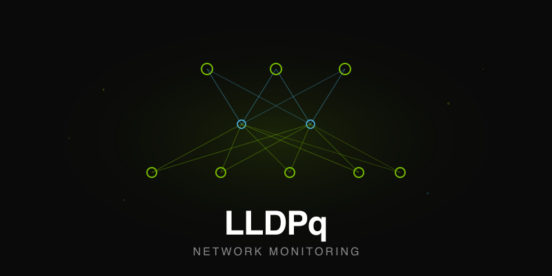

```
╔══════════════════════════════════════════════════════════╗
║                                                          ║
║     ██╗      ██╗      ██████╗   ██████╗    ██████╗       ║
║     ██║      ██║      ██╔══██╗  ██╔══██╗  ██╔═══██╗      ║
║     ██║      ██║      ██║  ██║  ██████╔╝  ██║   ██║      ║
║     ██║      ██║      ██║  ██║  ██╔═══╝   ██║▄▄ ██║      ║
║     ██████╗  ██████╗  ██████╔╝  ██║        ╚██████╔╝     ║
║     ╚═════╝  ╚═════╝  ╚═════╝   ╚═╝         ╚══▀▀═╝      ║
║                                                          ║
║      Network Monitoring for Cumulus Linux Switches       ║
║                                                          ║
╚══════════════════════════════════════════════════════════╝
```

simple network monitoring tool for Cumulus Linux switches

> *LLDPq is an independent project. It does not contain, derive from, or incorporate any code from any NVIDIA product.*

## Docker (run anywhere — Linux, macOS, even on a Cumulus switch)

No installation needed. Download the pre-built Docker image and run:

```bash
# Download — pick the right architecture
curl -O https://aliaydemir.com/lldpq-amd64.tar.gz   # x86_64 (Linux servers, Cumulus switches)
curl -O https://aliaydemir.com/lldpq-arm64.tar.gz   # ARM64  (Apple Silicon Mac, Ampere, RPi)

# Load image
sudo docker load < lldpq-amd64.tar.gz   # or lldpq-arm64.tar.gz

# Run (example data included, ready to use)
sudo docker run -d --name lldpq --network host --privileged lldpq:latest

# Shell into container
sudo docker exec -it -u lldpq lldpq bash
```

Open `http://<host-ip>` in your browser. That's it.

**First time setup:**
1. Login as admin → go to **Assets** page
2. Click **Edit Devices** → add your switch hostnames and IPs (see `devices.yaml` format below)
3. Click the orange **SSH Setup** button
4. Enter device password (twice to confirm)
5. Click **Run Setup** → SSH keys are generated and distributed to all devices automatically
6. Failed devices can be retried with a different password

**What you need:**
- Your switch hostnames and management IPs — entered via the web UI
- That's it. SSH keys are generated and distributed from the web UI.

**Works on:** Ubuntu, CentOS, RHEL, Debian, NVIDIA Cumulus Linux 5.x, macOS (Apple Silicon & Intel), any system with Docker.

**Cumulus switch only** — open port 80 in the ACL before accessing the web UI:
```bash
nv set acl acl-default-whitelist rule 200 match ip tcp dest-port 80
nv set acl acl-default-whitelist rule 200 action permit
nv config apply -y
```

**Persistent data** (optional — keeps monitoring data across restarts):
```bash
sudo docker run -d --name lldpq --network host \
  -v lldpq-data:/home/lldpq/lldpq/monitor-results \
  lldpq:latest
```

**Ansible support** (optional — enables VLAN/BGP reports, Fabric Config/Editor):

Ansible, ansible-lint, and collections (nvidia.nvue, community.general, ansible.netcommon) are pre-installed in the image. To use them, copy your Ansible project into the container:

```bash
# Option A: Mount at startup (recommended — changes persist on host)
sudo docker run -d --name lldpq --network host \
  -v ~/my_ansible_project:/home/lldpq/ansible:rw \
  -e ANSIBLE_DIR=/home/lldpq/ansible \
  lldpq:latest

# Option B: Copy into a running container (offline / air-gapped environments)
sudo docker cp ~/my_ansible_project lldpq:/home/lldpq/ansible
sudo docker exec lldpq bash -c "chown -R lldpq:www-data /home/lldpq/ansible && \
  sed -i 's|^ANSIBLE_DIR=.*|ANSIBLE_DIR=/home/lldpq/ansible|' /etc/lldpq.conf"
```
See [Ansible Integration](#ansible-integration) section below for directory structure requirements.

**Update/Rebuild Docker:**
```bash
# Stop and remove old container + image
sudo docker stop lldpq && sudo docker rm lldpq && sudo docker rmi lldpq:latest

# Load new image and run
sudo docker load < lldpq-amd64.tar.gz   # or lldpq-arm64.tar.gz
sudo docker run -d --name lldpq --network host lldpq:latest
```

**Remove completely:**
```bash
sudo docker stop lldpq && sudo docker rm lldpq && sudo docker rmi lldpq:latest
sudo docker volume rm lldpq-data lldpq-configs lldpq-hstr 2>/dev/null
rm -f ~/lldpq-*.tar.gz
```

**Copy files into a running container:**
```bash
# Copy a single file
sudo docker cp myfile.yaml lldpq:/home/lldpq/ansible/inventory/host_vars/

# Copy an entire directory
sudo docker cp ~/my_ansible_project lldpq:/home/lldpq/ansible

# Fix permissions after copy
sudo docker exec lldpq chown -R lldpq:www-data /home/lldpq/ansible
```

**Useful Docker commands:**
```bash
sudo docker logs lldpq                        # Container logs
sudo docker exec -it -u lldpq lldpq bash      # Shell as lldpq user
sudo docker exec -it lldpq bash               # Shell as root
sudo docker restart lldpq                     # Restart (keeps data + SSH keys)
sudo docker ps -a --filter name=lldpq          # Container status
```

**Built-in tools** (available inside the container shell):
`exa`, `nano`, `colordiff`, `dos2unix`, `bash-completion`, `net-tools`, `bzip2`, `jq`, `git`, `curl`, `tcpdump`, `ansible`, `ansible-lint`, `ansible-galaxy`

## Requirements (non-Docker install)

- **Ubuntu Server** 20.04+ (tested on 22.04, 24.04)
- SSH key-based access to Cumulus switches
- Sudo privileges on target switches

## [00] quick start  

``` 
git clone https://github.com/aliaydemir/lldpq-src.git
cd lldpq-src
./install.sh 
```

## [01] what it does

- validation lldp and monitors switches every 5 minutes
- collects bgp, optical, ber, link flap, hardware health data
- shows network topology with lldp
- web dashboard with real-time stats
- live network tables (MAC, ARP, VTEP, Routes, LLDP neighbors)
- tracepath: visual path tracing between any two IPs (intra-VRF, inter-VRF, external)
- device details page with command runner

## [02] analysis coverage

- **bgp neighbors**: state, uptime, prefix counts, health status
- **evpn summary**: VNI counts (L2/L3), Type-2/Type-5 route analysis
- **optical diagnostics**: power levels, temperature, bias current, link margins  
- **link flap detection**: carrier transitions on all interfaces (including breakouts)
- **bit error rate**: comprehensive error statistics with industry thresholds
- **hardware health**: cpu/asic temperatures, memory usage, fan speeds, psu efficiency
- **topology validation**: lldp neighbor verification against expected topology

## [02b] fabric search (live queries)

access via web UI: `http://<server>/search.html`

### global search
- search IP or MAC across **all devices** at once
- **cross-reference**: IP → finds associated MAC, MAC → finds associated IP
- **bond expansion**: shows physical ports for bond interfaces
- **vxlan filtering**: excludes vxlan interfaces for real physical data
- **route best match**: shows how each VRF would route an IP (longest prefix match)
  - VRF-based grouping with colored badges
  - "No Route" indicator for VRFs without matching routes
  - Device consistency check (shows if all devices use same route)
  - Uses cached data for fast queries

### per-device tables

| Tab | Description | Data Source |
|-----|-------------|-------------|
| **MAC** | MAC address table | `bridge fdb show` |
| **ARP** | ARP/Neighbor table per VRF | `ip neigh show` |
| **VTEP** | Remote VXLAN tunnel endpoints with MAC, Type, State | `bridge fdb show \| grep dst` |
| **Routes** | Routing table with VRF tabs, ECMP paths, AD/Metric | `vtysh -c "show ip route vrf all"` |
| **LLDP** | LLDP neighbor discovery | `lldpctl -f json` |

### features
- real-time SSH queries to devices
- **VRF tabs** for route filtering (click to filter by VRF)
- **route best match**: when IP not found, shows best matching route per VRF
- sortable table columns (click headers)
- search/filter support
- CSV export for MAC/ARP tables
- parallel queries for "All Devices" mode
- **fast subnet search**: cached-only queries for subnet patterns (e.g. `192.168.64`)

## [02c] device details & command runner

access via web UI: `http://<server>/device.html`

### tabs
| Tab | Description |
|-----|-------------|
| **Overview** | Device info, uptime, model, serial, OS version |
| **Ports** | Interface status with speed, state, neighbors |
| **Optical** | SFP/QSFP diagnostics with power levels, temperature |
| **BGP** | BGP neighbor status per VRF |
| **Logs** | Recent logs from syslog, FRR, switchd, NVUE |
| **Commands** | Interactive command runner with templates |
| **Capture** | Live packet capture (tcpdump) with PCAP download |
| **cl-support** | Generate diagnostic bundles for TAC support |

### command runner features
- **pre-built templates**: organized by category with color-coded icons
  - System & Hardware (green)
  - Interfaces & Ports (blue)
  - Layer 2 / Bridge (purple)
  - BGP & Routing (orange)
  - EVPN & VXLAN (teal)
  - EVPN MH / Bonds (pink)
  - MLAG / CLAG (indigo)
  - Logs & Debug (red)
- **interface selector**: dropdown with all switch interfaces
- **VRF selector**: query BGP/routes per VRF
- **bond selector**: view nv bond details, system bond details
- **custom commands**: run any allowed command on device
- **output display**: formatted command output with auto-scroll

### packet capture (tcpdump)
- **interface selection**: auto-populated dropdown including VLANs
- **filter presets**: common tcpdump filters (ICMP, ARP, LLDP, BGP, etc.)
- **live mode**: real-time packet output with polling
- **PCAP mode**: capture to file and download for Wireshark
- **duration/count controls**: configurable capture limits
- **cleanup**: automatic old PCAP cleanup, delete all PCAP button

### diagnostic bundle (cl-support)
- **background generation**: runs `cl-support -M -T0` in background
- **status polling**: real-time progress indicator
- **download/delete**: manage bundle files directly from UI
- **page exit warning**: prevents accidental navigation during generation

### security
- commands are whitelisted (only safe monitoring commands allowed)
- operators can use command runner for monitoring
- no configuration changes possible via command runner

## [02d] tracepath

access via web UI: `http://<server>/tracepath.html`

trace the network path between any two IPs across the fabric. uses cached fabric-scan data for instant results.

### features
- **source/dest IP input** with separate VRF selectors and auto-detect
- **swap button** to reverse source ↔ destination
- **3 scenarios**: intra-VRF, inter-VRF (border leaf + external gateway), external destination
- **same-device detection**: local switching when source and dest are on the same leaf
- **ECMP link health**: shows up/down link counts on spine/core layers from LLDP data
- **VRF auto-correct**: if user selects wrong dest VRF, auto-corrects from ARP data
- **summary header**: source/dest IP, device, VRF, VRF path, hop count

### path visualization

| Scenario | Path Shown |
|----------|------------|
| **same-pod intra-VRF** | Leaf → Spine (ECMP) → Leaf |
| **cross-pod intra-VRF** | Leaf → Spine → Core → Spine → Leaf |
| **inter-VRF** | Source → Spines → Border Leaf → External GW → Border Leaf → Spines → Dest |
| **external dest** (8.8.8.8) | Source → Spines → Border Leaf → External Network → Dest |
| **same device** | Source Host → Leaf (local switching) → Dest Host |

### universal algorithms (no hardcoding)

all path discovery is based on graph analysis — no hardcoded hostnames, IPs, or naming patterns:

| Algorithm | Method |
|-----------|--------|
| **tier detection** | LLDP neighbor degree analysis + BFS from leaves |
| **pod detection** | shared spine set intersection |
| **border leaf detection** | default route nexthop signature majority analysis |
| **core detection** | cross-pod spine tier-2 neighbor bridging |
| **link health** | LLDP bidirectional link status counting |

works with any Clos topology: 2-tier (leaf-spine), 3-tier (leaf-spine-core), or N-tier.

## [03] configuration files

edit these files:

```
~/lldpq/devices.yaml             # add your switches (required) - used by pping, zzh, send-cmd, get-conf
~/lldpq/topology.dot             # expected cable connections
~/lldpq/topology_config.yaml      # optional: customize device layers/icons (supports regex patterns)
~/lldpq/notifications.yaml        # optional: slack alerts + thresholds
~/lldpq/commands                 # optional: commands for send-cmd
```

### devices.yaml format

```yaml
defaults:
  username: cumulus

devices:
  10.10.100.10: Spine1            # simple: IP: Hostname
  10.10.100.11: Spine2 @spine     # with role: IP: Hostname @role
  10.10.100.12:                   # extended format
    hostname: Leaf1
    username: admin
    role: leaf
```

roles are optional tags for grouping. They are used for:
- **CLI filtering**: `zzh @spine`, `send-cmd -r leaf -c "uptime"`
- **Web UI grouping**: Device Details, Base Config deploy, and other pages group devices by role. Without roles, all devices appear in a single flat list which makes navigation harder on large fabrics.

Recommended roles: `leaf`, `spine`, `core`, `border`, `oob` (or any naming that fits your topology).

### endpoint_hosts (optional)

add extra hostnames for topology visualization in devices.yaml. supports exact names and wildcard patterns:

```yaml
endpoint_hosts:
  - border-router-01      # exact hostname
  - "*dgx*"               # pattern - all devices containing "dgx"
  - "leaf-*"              # pattern - all devices starting with "leaf-"
  - "*-gpu"               # pattern - all devices ending with "-gpu"
```

patterns are matched against devices found in LLDP neighbor data.

## [04] cron jobs (auto setup)

```
*/5 * * * * lldpq                       # system monitoring every 5 minutes
0 */12 * * * get-conf                   # config backup every 12 hours
* * * * * lldpq-trigger                 # web UI refresh buttons daemon
* * * * * fabric-scan.sh                # fabric topology scan (search data)
0 0 * * * git auto-commit               # daily config backup to git
33 3 * * * fabric-scan-cron.sh          # Ansible diff check (only if Ansible configured)
```

the `lldpq-trigger` daemon handles web UI buttons:
- **Run LLDP Check**: triggers lldp validation and topology update
- **Run Monitor**: triggers hardware/optical/bgp analysis
- **Refresh Assets**: triggers device inventory refresh

## [05] update

`install.sh` handles both fresh install and updates automatically. It detects existing installations and runs in update mode:

```
cd lldpq-src
git pull                    # get latest code
./install.sh                # auto-detects: fresh install or update
```

In update mode, a full backup is created automatically at `~/lldpq-backup-YYYY-MM-DD_HH-MM/` before any changes:

### what gets backed up & preserved:
- **config files**: devices.yaml, notifications.yaml, topology.dot, topology_config.yaml
- **monitoring data**: monitor-results/, lldp-results/, alert-states/
- **system configs**: /etc/lldpq.conf, /etc/lldpq-users.conf
- **DHCP configs**: /etc/dhcp/dhcpd.conf, /etc/dhcp/dhcpd.hosts
- **SSH keys**: ~/.ssh/id_*
- **git history**: .git/ (config change tracking)

Use `./install.sh --help` for all options. Use `./install.sh -y` for non-interactive mode (CI/scripts).

## [06] requirements

- **Linux server** (Ubuntu 20.04+ recommended, tested on 22.04 and 24.04)
- **NVIDIA Cumulus Linux 5.x switches** with management IP access
- **SSH key auth** to all switches (setup via web UI — see [SSH Setup](#08-ssh-setup))
- All other dependencies (nginx, fcgiwrap, python3, etc.) are installed automatically by `install.sh`

## [07] disk usage

Monitor data grows ~50MB/day per fabric. Automatic cleanup keeps last 24 hours.

```
~/lldpq/monitor-results/     # ~50MB   analysis results (HTML reports)
~/lldpq/lldp-results/        # ~10MB   LLDP topology data
/var/www/html/configs/        # varies  device config backups (get-conf)
/var/www/html/hstr/          # ~5MB    historical data
```

## [08] ssh setup

### web UI (recommended — works in Docker too)

1. Login as admin → go to **Assets** page
2. Click the orange **SSH Setup** button
3. Enter device password (twice to confirm)
4. Click **Run Setup** — generates SSH key (if missing) + distributes to all devices + configures sudo
5. Results shown per device. Failed devices can be retried with a different password.

### CLI (bare metal install)

```
cd ~/lldpq && ./send-key.sh   # auto-installs deps, generates key, prompts password
cd ~/lldpq && ./sudo-fix.sh    # configures passwordless sudo for cumulus user
```

## [09] cli tools

all tools use `devices.yaml` as the single source of device information.

```bash
# parallel ping
pping                              # ping all devices from devices.yaml
pping -r spine                     # ping only @spine devices
pping -r leaf -v mgmt              # ping @leaf via mgmt VRF
pping --roles                      # list available roles
pping -f /path/to/devices.yaml     # use custom devices.yaml
pping -h                           # show help

# send commands to devices
send-cmd                           # run commands from ~/lldpq/commands file
send-cmd -c "nv show system"       # run single command on all devices
send-cmd -c "uptime" -c "hostname" # run multiple commands
send-cmd -r spine -c "uptime"      # run only on @spine devices
send-cmd -r leaf -c "nv show bgp"  # run only on @leaf devices
send-cmd --roles                   # list available roles
send-cmd -e                        # edit commands file
send-cmd -l                        # list commands file
send-cmd -h                        # show help

# ssh manager (ncurses UI)
zzh                                # interactive ssh manager
zzh spine                          # filter: show only "spine" in name
zzh @leaf                          # filter by role (from devices.yaml)
zzh -f /path/to/devices.yaml       # use custom devices.yaml
zzh -h                             # show help

# config backup
get-conf                           # backup configs from all devices
get-conf -                         # backup from single device (interactive select)

# monitoring (usually runs via cron, but can be run manually)
lldpq                              # full run: assets + lldp check + monitor + alerts
```

## [10] authentication

web interface is protected with session-based authentication:

### default credentials:
```
admin / admin         # full access (includes Ansible Config Editor if configured)
operator / operator   # limited access
```

### features:
- **session-based login**: login page with 8-hour session timeout
- **remember me option**: stay logged in for 7 days
- **role-based access**: admin vs operator privileges
- **password management**: admin can change all passwords via UI
- **user management**: admin can create/delete operator users

### roles:
| Role | Dashboard | Topology View | Topology Edit | Configs | SSH Setup | Ansible Editor* | User Management |
|------|-----------|---------------|---------------|---------|-----------|-----------------|-----------------|
| admin | Yes | Yes | Yes | Yes | Yes | Yes | Yes |
| operator | Yes | Yes | No | Yes | No | No | No |

*Ansible Editor only visible when Ansible is configured (not required for core features).

**Operator restrictions:**
- Cannot edit `topology.dot` or `topology_config.yaml`
- Cannot access SSH Setup
- Cannot access any Ansible features (entire Ansible menu is hidden)
- Cannot manage users

### user management (admin only):
1. login as admin
2. click username in sidebar
3. select "User Management"

**capabilities:**
- view all existing users and their roles
- create new users (automatically assigned "operator" role)
- delete users (except admin)
- deleted users are immediately logged out

**security rules:**
- new users can only be created with "operator" role
- admin user cannot be deleted
- users cannot delete themselves

### change passwords:
1. login as admin
2. click username in sidebar
3. select "Change Passwords"
4. choose user and set new password

**important**: change default passwords after installation!

## [11] alerts & notifications

get real-time alerts for network issues via Slack:

```
cd ~/lldpq
nano notifications.yaml                               # add webhook URLs + enable alerts
python3 test_alerts.py                               # test configuration
```

### setup webhooks:

**slack:**  
1. go to https://api.slack.com/apps → create app → incoming webhooks
2. activate → add to workspace → choose channel → copy webhook url

### alert types:
- **hardware**: cpu/asic temp, fan failures, memory usage, psu issues
- **network**: bgp neighbors down, excessive link flaps, optical power
- **system**: critical logs, disk usage, high load average
- **recovery**: automatic notifications when issues resolve

### how it works:
- **smart detection**: only alerts on state changes (no spam)
- **1-minute checks**: runs with lldpq cron job every minute for fast topology updates
- **customizable**: adjust thresholds in notifications.yaml
- **state tracking**: prevents duplicate alerts, tracks recovery

alerts automatically start working once webhooks are configured. check `~/lldpq/alert-states/` for alert history.

## [12] streaming telemetry

real-time telemetry dashboard with OTEL Collector + Prometheus (optional feature):

### installation options

**option 1: during install**
```bash
./install.sh
# Answer "y" to "Enable streaming telemetry support?"
```

**option 2: enable later (native install)**
```bash
./install.sh --enable-telemetry    # installs Docker, starts stack automatically
```

**option 3: Docker deployment**

Telemetry stack consists of 3 separate containers (OTEL Collector, Prometheus, Alertmanager).
These run on the **host** alongside the LLDPq container — not inside it.

```bash
# Step 1: Start LLDPq with telemetry enabled
sudo docker run -d --name lldpq --network host --privileged \
  -e TELEMETRY_ENABLED=true \
  lldpq:latest

# Step 2: Extract telemetry stack from container and start on host
sudo docker cp lldpq:/home/lldpq/lldpq/telemetry ./telemetry
cd telemetry
sudo docker compose up -d       # starts OTEL Collector, Prometheus, Alertmanager
```

To enable telemetry on an already running container, recreate it:
```bash
sudo docker stop lldpq && sudo docker rm lldpq
sudo docker run -d --name lldpq --network host --privileged \
  -e TELEMETRY_ENABLED=true \
  lldpq:latest
```

> **Note:** `./install.sh --enable-telemetry` cannot be run inside a container. It is for native installs only.

Docker CLI for troubleshooting:
```bash
sudo docker exec -it lldpq bash                                       # enter container shell
sudo docker exec lldpq cat /etc/lldpq.conf                            # check config
sudo docker logs lldpq                                                # view startup logs
sudo docker exec lldpq curl -s localhost:9090/api/v1/query?query=up   # test prometheus
```

**disable — native install:**
```bash
./install.sh --disable-telemetry   # stops containers, removes volumes, updates config
```

**disable — Docker deployment:**
```bash
# Stop telemetry stack on host
cd telemetry
sudo docker compose down -v         # stops containers + removes stored metrics

# Recreate LLDPq container without telemetry
sudo docker stop lldpq && sudo docker rm lldpq
sudo docker run -d --name lldpq --network host --privileged lldpq:latest
```

### workflow

| Action | Tool | What Happens |
|--------|------|--------------|
| Install stack | CLI: `./install.sh --enable-telemetry` | Docker installed, stack started |
| Enable on switches | Web UI: Enable Telemetry | Selected switches configured, metrics flow |
| Disable on switches | Web UI: Disable Telemetry | Selected switches unconfigured |
| Stop stack | CLI: `./install.sh --disable-telemetry` | Containers stopped |
| Remove everything | CLI: `./install.sh --disable-telemetry` | Containers + data deleted |

### enable on switches

from the web UI (admin only):
1. go to **Telemetry** page (`http://<server>/telemetry.html`)
2. click **Configuration** tab → **Enable Telemetry**
3. enter your Collector IP (the server running OTEL)
4. select devices to configure (grouped by inventory, with real-time status)
5. click **Enable on Selected Devices**

**note**: operators can view the dashboard but cannot enable/disable telemetry.

### dashboard features
- **real-time metrics**: interface throughput, errors, drops
- **chart visualization**: time-series graphs with device filtering
- **top interfaces**: top 20 interface utilization ranking across fabric
- **AI ethernet stats**: TX wait, buffer utilization, pause frames, AR congestion, ECN marked packets
- **auto-refresh**: updates every 10 seconds

### available metrics
| Metric | Description |
|--------|-------------|
| Interface Stats | TX/RX bytes, packets, errors, drops |
| AI Ethernet Stats | TX wait, buffer utilization, pause frames, AR congestion, ECN marked packets |

### configuration files

```
~/lldpq/telemetry/
├── docker-compose.yaml           # container orchestration
├── config/
│   ├── otel-config.yaml           # OTEL Collector config
│   ├── prometheus.yaml           # Prometheus scrape config
│   ├── alertmanager.yaml         # notification config (edit for Slack/email)
│   └── alert_rules.yaml          # alert definitions
├── start.sh                      # management script
└── README.md                     # detailed setup guide
```

### lldpq.conf options

```bash
TELEMETRY_ENABLED=true              # feature enabled
PROMETHEUS_URL=http://localhost:9090 # Prometheus API endpoint
TELEMETRY_COLLECTOR_IP=192.168.1.100 # saved collector IP (auto-set)
TELEMETRY_COLLECTOR_PORT=4317        # saved collector port
TELEMETRY_COLLECTOR_VRF=mgmt         # saved VRF
```

### ports reference
| Service | Port | Description |
|---------|------|-------------|
| OTEL Collector | 4317 | OTLP gRPC (switches connect here) |
| OTEL Collector | 4318 | OTLP HTTP |
| Prometheus | 9090 | Web UI & API |
| Alertmanager | 9093 | Alert notifications |

### pre-configured alerts
- **InterfaceDown**: interface operationally down
- **HighInterfaceUtilization**: >80% for 5 minutes
- **HighInterfaceErrors**: >10 errors/sec for 5 minutes
- **HighPacketDrops**: >100 drops/sec for 5 minutes
- **BGPSessionDown**: BGP not in established state
- **HighCPUTemperature**: >85°C for 5 minutes
- **FanFailure**: fan status failure

### safe disable behavior

when disabling via web UI:
- only LLDPq telemetry config is removed from selected switches
- other telemetry configurations (if any) are preserved
- docker stack continues running (manage via CLI)
- metrics history is preserved

when disabling via CLI (`--disable-telemetry`):
- containers and volumes are completely removed
- all metrics history is deleted
- feature is marked as disabled

## [13] troubleshooting

```bash
# check if cron is running
grep lldpq /etc/crontab

# check if trigger daemon is running
ps aux | grep lldpq-trigger

# manual run
cd ~/lldpq && ./assets.sh && ./check-lldp.sh && ./monitor.sh

# check logs  
ls -la /var/www/html/monitor-results/

# check trigger logs
cat /tmp/lldpq-trigger.log

# check telemetry stack
cd telemetry && ./start.sh status

# test prometheus connection
curl 'http://localhost:9090/api/v1/query?query=up'
```

## [14] Provision (ZTP & Device Management)

Web-based Zero Touch Provisioning and device lifecycle management. Access via **Provision** in the sidebar.

### DHCP Server Tab

Manage the DHCP server for automated IP assignment to new switches:

- **DHCP Configuration**: subnet, range, gateway, DNS, lease time, ZTP URL — all editable from web UI
- **Interface Selection**: dropdown with detected interfaces and their IPs
- **Discovery Range**: configurable IP range for subnet scanning (e.g. `192.168.100.11-192.168.100.199,192.168.100.201-192.168.100.252`)
- **Post-Provision Actions**: automatic actions on newly provisioned devices (toggles):
  - Deploy Base Config (sw-base files)
  - Disable ZTP (`sudo ztp -d`)
  - Set hostname from binding (`nv set system hostname`)
- **Service Control**: Start / Restart / Stop buttons with live status indicator

### Discovered Devices (Subnet Scanner)

Scans the entire discovery range with ping + SSH probe for device classification:

| Device Type | How Detected | Color |
|-------------|-------------|-------|
| **Provisioned** | SSH key auth works (`cumulus` user) | Green |
| **Not Provisioned** | SSH connects but key rejected (needs ZTP) | Orange |
| **Other** | SSH refused or different device | Gray |
| **Unreachable** | No ping response | Red |

Additional stat cards: **MAC Mismatch** (binding MAC vs discovered MAC differ) and **No Binding** (IP alive but not in DHCP bindings).

- Auto-scans every 5 minutes in background (silent, no loading indicator)
- Manual **Scan** button for immediate full scan with results
- Cache-based loading for instant page display

### Post-Provision Automation

When a device is detected as **Provisioned** (SSH key works) and has no marker file:

```
Provisioned device found → check /etc/lldpq-base-deployed marker
  → marker exists → skip (already configured)
  → marker missing → run post-provision actions:
      1. SCP sw-base files (bashrc, motd, tmux, nanorc, cmd, nvc, nvt, exa)
      2. sudo ztp -d (disable ZTP)
      3. nv set system hostname <binding-hostname> && nv config apply
      4. touch /etc/lldpq-base-deployed (write marker)
```

### Bindings Tab

DHCP static bindings (MAC → IP → Hostname):

- **Add/Edit/Delete** bindings with hostname, MAC, IP
- **Bulk Import**: paste `hostname MAC IP` format (one per line)
- **Placeholder MAC**: use `xx:xx:xx:xx:xx:xx` for devices where MAC is not yet known
- **Discovered MAC** column: shows actual MAC from last scan (green=match, red=mismatch)
- **Live** column: reachability indicator from last scan
- **Save & Restart DHCP**: writes `dhcpd.hosts` and restarts service

### ZTP Script Tab

Manage the Zero Touch Provisioning script (`cumulus-ztp.sh`):

- **SSH Key**: generate, import, or copy the public key used for provisioning
- **Quick Settings**: target OS version, default password, image server IP
- **Apply to Script**: auto-generates full ZTP template or updates existing script via regex
- **OS Image**: upload/delete Cumulus Linux `.bin` images for ZTP OS upgrades
- **Script Editor**: collapsible Monaco-style editor with Reload/Save

The ZTP script handles: OS version check + upgrade, password change, sudo fix, SSH key installation.

### Base Config Tab

Deploy standard switch tools and configs to selected devices:

- **Device Selector**: grouped by role, with checkboxes, search, All/None
- **Files deployed**: `bash.bashrc`, `motd.sh`, `tmux.conf`, `nanorc`, `cmd`, `nvc`, `nvt`, `exa`
- **Parallel deploy**: 20 concurrent SSH/SCP workers
- **Progress table**: per-device OK/FAIL status
- **ZTP disable** option after deploy

### Full ZTP Workflow

```
New switch powers on
  → DHCP assigns IP (from dhcpd.conf + dhcpd.hosts bindings)
  → ZTP script runs automatically (cumulus-ztp.sh):
      - Check/upgrade OS version (onie-install if needed)
      - Change default password
      - Configure passwordless sudo
      - Install SSH public key
  → Discovery scan detects device:
      - Ping OK → reachable
      - SSH key auth OK → Provisioned
      - No marker → auto post-provision:
          - Deploy sw-base (bashrc, motd, tmux, tools)
          - Disable ZTP
          - Set hostname from DHCP binding
          - Write marker
  → Device fully configured, zero manual intervention
```

## [15] Ansible Integration

LLDPq's Ansible features (Fabric Editor, Fabric Config, Fabric Deploy) are designed for a
specific **Cumulus Linux NVUE automation structure**. They are not a generic Ansible UI.
The Ansible menu is automatically hidden when `$ANSIBLE_DIR` is not configured.

**Core LLDPq features (LLDP, monitoring, search, tracepath, telemetry, provisioning) work without Ansible.**

### Required Directory Structure

```
$ANSIBLE_DIR/
├── inventory/
│   ├── inventory.ini              # or hosts (INI format, standard Ansible)
│   ├── host_vars/                 # per-device YAML configs (standard Ansible)
│   │   ├── leaf-01.yaml
│   │   └── spine-01.yaml
│   └── group_vars/
│       └── all/
│           ├── sw_port_profiles.yaml   # port profile definitions
│           ├── vlan_profiles.yaml      # VLAN profile definitions
│           └── bgp_profiles.yaml       # BGP profile definitions
├── playbooks/
│   ├── diff_switch_configs.yaml                # compare running vs intended config
│   ├── deploy_switch_configs.yaml              # push config to devices
│   └── generate_switch_nvue_yaml_configs.yaml  # generate host_vars from templates
├── roles/       # optional (variable extraction for editor autocomplete)
└── templates/   # optional (Jinja2 template scanning)
```

### Feature Dependencies

| Feature | Required Files | Notes |
|---------|---------------|-------|
| Fabric Editor (file browser + git) | `$ANSIBLE_DIR` set | Works with any directory structure |
| Fabric Config (edit device configs) | `inventory/host_vars/{device}.yaml` | Standard Ansible layout |
| VLAN/Port profile management | `group_vars/all/vlan_profiles.yaml`, `sw_port_profiles.yaml` | See YAML key requirements below |
| BGP profile management + route leaking | `group_vars/all/bgp_profiles.yaml` | See YAML key requirements below |
| Diff (compare running vs intended) | `playbooks/diff_switch_configs.yaml` | Playbook name is hardcoded |
| Deploy (push config to device) | `playbooks/deploy_switch_configs.yaml` | Playbook name is hardcoded |
| Generate (create host_vars from templates) | `playbooks/generate_switch_nvue_yaml_configs.yaml` | Playbook name is hardcoded |
| VLAN/VRF/BGP reports | `group_vars/all/*.yaml` + `host_vars/` | Read-only analysis |

### YAML Key Requirements

The profile YAML files must use specific top-level keys and structures:

**`sw_port_profiles.yaml`** — top-level key: `sw_port_profiles`
```yaml
sw_port_profiles:
  SERVER_1G:
    speed: 1000
    mtu: 9216
    ...
```

**`vlan_profiles.yaml`** — top-level key: `vlan_profiles`
```yaml
vlan_profiles:
  TENANT_A:
    vlans:
      100:
        name: "Production"
        vrf: "VRF_A"
        ...
```

**`bgp_profiles.yaml`** — top-level key: `bgp_profiles`
```yaml
bgp_profiles:
  TENANT_A:
    enable_evpn: true
    peer_groups:
      External:                    # "External" peer group name is hardcoded
        description: "External-Connections"
        peers:
          10.0.0.1:
            description: "ISP-1"
            remote_as: 65000
    ipv4_unicast_af:
      route_import:
        from_vrf:                  # route leaking structure
          - VRF_SHARED
  VxLAN_UNDERLAY_LEAF:             # profiles starting with "VxLAN_UNDERLAY" are filtered out
    ...
```

Key conventions used by LLDPq:
- BGP peer group named `External` — used for external BGP peer management UI
- Profiles prefixed with `VxLAN_UNDERLAY` — automatically excluded from user-facing lists
- `ipv4_unicast_af.route_import.from_vrf` — used for inter-VRF route leaking management
- `peer_groups.External.peers` — used for external BGP neighbor CRUD operations

If these keys or structures differ in your Ansible repo, the corresponding UI features will not work correctly.

## [16] license

This project is licensed under the **MIT License** - see the [LICENSE](LICENSE) file for details.

### What this means:
- ✅ **Free to use** for any purpose (personal, commercial, enterprise)
- ✅ **Modify and distribute** as you wish
- ✅ **No warranty** - use at your own risk
- ✅ **Only requirement**: Keep the original license notice

### Contributing
Contributions are welcome! Please feel free to submit a Pull Request.

---

done.
