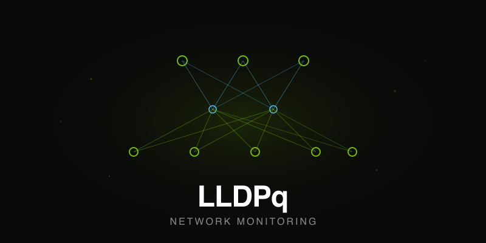

```
╔══════════════════════════════════════════════════════════╗
║                                                          ║
║     ██╗      ██╗      ██████╗   ██████╗    ██████╗       ║
║     ██║      ██║      ██╔══██╗  ██╔══██╗  ██╔═══██╗      ║
║     ██║      ██║      ██║  ██║  ██████╔╝  ██║   ██║      ║
║     ██║      ██║      ██║  ██║  ██╔═══╝   ██║▄▄ ██║      ║
║     ██████╗  ██████╗  ██████╔╝  ██║        ╚██████╔╝     ║
║     ╚═════╝  ╚═════╝  ╚═════╝   ╚═╝         ╚══▀▀═╝      ║
║                                                          ║
║      Network Monitoring for Cumulus Linux Switches       ║
║                                                          ║
╚══════════════════════════════════════════════════════════╝
```

simple network monitoring tool for Cumulus Linux switches

> *LLDPq is an independent project. It does not contain, derive from, or incorporate any code from any NVIDIA product.*
>
> *This software is provided "as is" without warranty. Always test in a lab environment before deploying to production networks.*

## Docker

For Docker installation, persistent volumes, DHCP/ONIE provisioning, updates,
streaming telemetry, rollback boundaries, and removal, see the
[Docker deployment guide](DOCKER.md).

Current images normalize the private Provision/config-write journal to
`lldpq:www-data:700` on first start and preserve that ownership across volume
recreation. An immediate restart loop with
`could not secure persistent config-write journal directory` indicates an
older image or an incompatible host bind mount; update the image and use the
documented `lldpq-provision-state` volume.

## Requirements (non-Docker install)

- **Ubuntu Server** 22.04+ (tested on 22.04, 24.04) — Python 3.9+ required
- **NVIDIA Cumulus Linux 5.x switches** reachable through their management IPs
- SSH key authentication to all switches (Setup can distribute the key)
- passwordless sudo for the LLDPq service account and the switch login account

`install.sh` installs the normal runtime services and OS packages. Air-gapped
package details are covered under
[dependency management](#06-dependency-management).

## Contents

- [Docker](#docker)
- [Requirements (non-Docker install)](#requirements-non-docker-install)
- [00 · Quick start](#00-quick-start)
- [01 · What it does](#01-what-it-does)
- [02 · Analysis coverage](#02-analysis-coverage)
  - [02a · EVPN multi-homing](#02a-evpn-multi-homing-analysis)
  - [02b · Fabric search](#02b-fabric-search-live-queries)
  - [02c · Device details](#02c-device-details-command-runner)
  - [02d · Tracepath](#02d-tracepath)
  - [02e · Duplicate detection](#02e-duplicate-address-detection)
  - [02f · Ask-AI](#02f-ask-ai-admin-only)
  - [02g · Lifecycle and Analysis Scope](#02g-switch-lifecycle-and-analysis-scope)
  - [02h · Console](#02h-interactive-console-admin-only)
  - [02i · Fleet Commands](#02i-fleet-commands-admin-only)
  - [02j · Machine-readable exports](#02j-machine-readable-exports-public-api)
- [03 · Configuration files](#03-configuration-files)
  - [03a · Inventory & Bootstrap](#03a-inventory-bootstrap-admin-only)
  - [03b · Guided Setup](#03b-guided-web-setup-setup-page)
- [04 · Cron jobs](#04-cron-jobs-auto-setup)
- [05 · Update](#05-update)
- [06 · Dependency management](#06-dependency-management)
- [07 · Disk usage](#07-disk-usage)
- [08 · SSH setup](#08-ssh-setup)
- [09 · CLI tools](#09-cli-tools)
- [10 · Authentication](#10-authentication)
- [11 · Alerts & notifications](#11-alerts-notifications)
- [12 · Streaming telemetry](#12-streaming-telemetry)
- [13 · Troubleshooting](#13-troubleshooting)
- [14 · Provision](#14-provision-ztp-device-management)
- [15 · Ansible Integration](#15-ansible-integration)
- [16 · License](#16-license)

## [00] quick start  

``` 
git clone https://github.com/aliaydemir/lldpq-src.git
cd lldpq-src
./install.sh 
```

## [01] what it does

- validates LLDP and monitors switches every 10 minutes
- collects BGP/EVPN, EVPN multi-homing, optical, BER, PFC/ECN, link-flap,
  hardware-health and system-log data
- shows network topology with lldp
- auto-refreshing, generation-consistent web dashboard snapshots
- live network tables (MAC, ARP, VTEP, Routes, LLDP neighbors)
- imports versioned P2P/IPAM design workbooks and generates LLDPq bootstrap files
- tracepath: visual path tracing between any two IPs (intra-VRF, inter-VRF, external)
- device details page with command runner
- responsive web UI with an off-canvas mobile navigation sidebar

## [02] analysis coverage

- **bgp neighbors**: state, uptime, prefix counts, health status
- **evpn summary**: VNI counts (L2/L3), Type-2/Type-5 route analysis
- **evpn multi-homing**: ESI correlation across PEs, DF/non-DF election,
  bond/LACP member state, bypass activity, VNI consistency and BGP ES state
- **duplicate address detection**: duplicate IP/MAC detection via EVPN DAD + MAC-mobility sequences, with severity, quiesced/aged lifecycle, and per-port interface descriptions (see [02e])
- **optical diagnostics**: power levels, temperature, bias current, link
  margins, unplugged modules and ports whose diagnostics are unavailable
- **link flap detection**: carrier transitions on all interfaces (including breakouts), with time-windowed flap counts (1h / 12h / 24h)
- **Link error / BER**: directional frame-error density from interface counters, plus separately graded raw/effective PHY BER and PHY symbol-error deltas
- **PFC/ECN**: telemetry-free per-port analysis of traffic-class 3 ECN
  marks, transmitted frames, unicast-buffer/WRED discards, and
  switch-priority 3 RX/TX pause frames. The first usable sample establishes a
  baseline; later samples show reset-safe deltas, average rates, ECN-mark
  percentage, and combined discard delta. Missing counters remain unavailable
  rather than becoming zero, and the page applies no arbitrary
  warning/critical thresholds.
- **hardware health**: cpu/asic temperatures, memory usage, fan speeds, psu
  efficiency, plus explicit Unknown coverage for unreachable/uncollected devices
- **system logs**: critical/error/warning/info counts with current-device
  coverage and per-device findings
- **topology validation**: lldp neighbor verification against expected topology

### PFC/ECN report

The report distinguishes quiet, ECN, PFC, combined ECN+PFC, discard,
baseline, reset, missing-data, and collection-failure states. It includes a
Metric Guide, device/status/text filters, clickable summary filters, sortable
columns, and CSV export of the visible rows.

## [02a] EVPN multi-homing analysis

Access via the **EVPN-MH** menu
(`/monitor-results/evpn-mh-analysis.html`).

The analyzer correlates Ethernet Segment Identifiers across local PEs using
NVUE, FRR/BGP ES-EVI state, Linux bond/link details and per-member LACP state.
It reports:

- **Healthy** — both PEs and bonds are operational, LACP is synchronized,
  remote ES state is present and exactly one PE is DF
- **Bypass** — LACP bypass is actively forwarding; dual-DF behavior is treated
  according to bypass semantics rather than reported as an ordinary conflict
- **Inactive** — one or more local ES bonds are down
- **Warning** — orphan ESI, missing remote ES, unsynchronized LACP, VNI
  mismatch or missing BGP ES state
- **Critical** — ESI collision, inconsistent BGP VNI state, or dual/no DF
  while both remote PEs are active and bypass is not active

Summary cards filter the device-first table by health, bypass, inactive,
inconsistent and orphan state. Expanding a row shows both PE attachments and
member-level MII/synchronization/bypass evidence. Missing device collections
remain visible through a partial-coverage banner and are never converted into
healthy zeros.

## [02b] fabric search (live queries)

access via web UI: `http://<server>/search.html`

### global search
- search IP or MAC across **all devices** at once
- **cross-reference**: IP → finds associated MAC, MAC → finds associated IP
- **bond expansion**: shows physical ports for bond interfaces
- **vxlan filtering**: excludes vxlan interfaces for real physical data
- **route best match**: shows how each VRF would route an IP (longest prefix match)
  - VRF-based grouping with colored badges
  - "No Route" indicator for VRFs without matching routes
  - Device consistency check (shows if all devices use same route)
  - Uses cached data for fast queries

### per-device tables

| Tab | Description | Data Source |
|-----|-------------|-------------|
| **MAC** | MAC address table | `bridge fdb show` |
| **ARP** | ARP/Neighbor table per VRF | `ip neigh show` |
| **VTEP** | Remote VXLAN tunnel endpoints with MAC, Type, State | `bridge fdb show \| grep dst` |
| **Routes** | Routing table with VRF tabs, ECMP paths, AD/Metric | `vtysh -c "show ip route vrf all"` |
| **LLDP** | LLDP neighbor discovery | `lldpctl -f json` |

### features
- real-time SSH queries to devices
- **VRF tabs** for route filtering (click to filter by VRF)
- **route best match**: when IP not found, shows best matching route per VRF
- sortable table columns (click headers)
- search/filter support
- CSV export for MAC/ARP tables
- "All Devices" mode serves results from the fabric-scan cache; single-device queries run live over SSH
- **fast subnet search**: cached-only queries for subnet patterns (e.g. `192.168.64`)

## [02c] device details & command runner

access via web UI: `http://<server>/device.html`

### tabs
| Tab | Description |
|-----|-------------|
| **Overview** | Optical port health and log alert summary cards |
| **Ports** | Interface status with speed, state, neighbors |
| **Optical** | SFP/QSFP diagnostics with power levels, temperature |
| **NVT** | Runs the read-only `nvt` helper with a 45-second timeout and displays a colorized interface summary: admin/oper state, speed, MTU, type, VLANs, VRF, LLDP neighbor/port, description, and IP addresses. It is loaded on first use and can be refreshed independently. |
| **BGP** | BGP neighbor status per VRF |
| **Logs** | Recent logs from syslog, FRR, switchd, NVUE |
| **Config** | Displays `nv config show -o commands`, `nv config show -o yaml`, or `nv config diff`, with live filtering and download support. |
| **Command Runner** | Interactive command runner with templates |
| **Capture** | Live packet capture (tcpdump) with PCAP download |
| **cl-support** | Generate diagnostic bundles for TAC support |

### command runner features
- **pre-built templates**: organized by category with color-coded icons
  - System & Hardware (green)
  - Interfaces & Ports (blue)
  - Layer 2 / Bridge (purple)
  - BGP & Routing (orange)
  - EVPN & VXLAN (teal)
  - EVPN MH / Bonds (pink)
  - MLAG / CLAG (indigo)
  - Logs & Debug (red)
- **interface selector**: dropdown with all switch interfaces
- **VRF selector**: query BGP/routes per VRF
- **bond selector**: view nv bond details, system bond details
- **custom commands**: run any allowed command on device
- **output display**: formatted command output with auto-scroll

### packet capture (tcpdump)
- **interface selection**: auto-populated dropdown including VLANs
- **filter presets**: common tcpdump filters (ICMP, ARP, LLDP, BGP, etc.)
- **live mode**: real-time packet output with polling
- **PCAP mode**: capture to file and download for Wireshark
- **duration/count controls**: configurable capture limits
- **cleanup**: automatic old PCAP cleanup, delete all PCAP button

### diagnostic bundle (cl-support)
- **background generation**: runs `cl-support -M -T0` in background
- **status polling**: real-time progress indicator
- **download/delete**: manage bundle files directly from UI
- **page exit warning**: prevents accidental navigation during generation

### security
- commands are allowlisted diagnostics, with tightly scoped packet-capture,
  capture/bundle cleanup, and interface up/down (port bounce) operations used
  by Fabric Migration
- switch configuration commands are blocked

> **Authorization:** Device Details—including NVT, Config, and Command
> Runner—is admin-only. Operators can use the shared monitoring and analysis
> views, but cannot open Device Details or execute device commands.

## [02d] tracepath

access via web UI: `http://<server>/tracepath.html`

trace the network path between any two IPs across the fabric. uses cached fabric-scan data for instant results.

### features
- **source/dest IP input** with separate VRF selectors and auto-detect
- **swap button** to reverse source ↔ destination
- **3 scenarios**: intra-VRF, inter-VRF (border leaf + external gateway), external destination
- **same-device detection**: local switching when source and dest are on the same leaf
- **ECMP link health**: shows up/down link counts on spine/core layers from LLDP data
- **VRF auto-correct**: if user selects wrong dest VRF, auto-corrects from ARP data
- **summary header**: source/dest IP, device, VRF, VRF path, hop count

### path visualization

| Scenario | Path Shown |
|----------|------------|
| **same-pod intra-VRF** | Leaf → Spine (ECMP) → Leaf |
| **cross-pod intra-VRF** | Leaf → Spine → Core → Spine → Leaf |
| **inter-VRF** | Source → Spines → Border Leaf → External GW → Border Leaf → Spines → Dest |
| **external dest** (8.8.8.8) | Source → Spines → Border Leaf → External Network → Dest |
| **same device** | Source Host → Leaf (local switching) → Dest Host |

### universal algorithms (no hardcoding)

all path discovery is based on graph analysis — no hardcoded hostnames, IPs, or naming patterns:

| Algorithm | Method |
|-----------|--------|
| **tier detection** | LLDP neighbor degree analysis + BFS from leaves |
| **pod detection** | shared spine set intersection |
| **border leaf detection** | default route nexthop signature majority analysis |
| **core detection** | cross-pod spine tier-2 neighbor bridging |
| **link health** | LLDP bidirectional link status counting |

works with 2-tier (leaf-spine) and 3-tier (leaf-spine-core) Clos topologies.

## [02e] duplicate address detection

access via web UI: **Duplicate** menu (`/monitor-results/duplicate-analysis.html`)

The report correlates current FRR EVPN duplicate-address-detection (DAD)
output, EVPN mobility sequences, local FDB entries, IPv4 neighbor data,
interface descriptions, and recent FRR duplicate logs. EVPN-derived IP/MAC
findings are keyed by VNI—the fabric-wide L2 domain—so different per-observer
VLAN views cannot split one conflict into duplicate rows. The resolved access
VLAN is displayed when available. Kernel-only FDB/ARP evidence can fall back
to VLAN grouping, but an unknown VNI is displayed as `—` rather than being
fabricated from the VLAN number.

### finding types

| Finding | Meaning |
|---------|---------|
| **Active IP duplicate** | A current authoritative FRR IP DAD row has a recent duplicate event or its EVPN sequence increased since the previous analysis sample |
| **Quiesced IP duplicate** | A current authoritative FRR IP DAD row is still present but is flat/old; after seven quiet days it is collapsed under **Show aged** |
| **Confirmed MAC conflict** | The same MAC is currently LOCAL on physical switch ports on at least two switches; bond/EVPN-MH attachment is excluded |
| **MAC DAD finding** | A current/latched FRR MAC DAD flag or recent FRR DAD event; a flag alone does not prove simultaneous owners |
| **Active MAC mobility** | A per-observer sequence delta meets the switch's configured DAD moves/window policy; the fallback policy is 5 moves / 180 seconds |
| **Historical mobility** | Below-threshold movement or an extreme but currently flat mobility sequence; shown separately and not counted as a confirmed MAC conflict |
| **Possible loop** | A MAC that is not currently DAD-flagged, is not a confirmed MAC conflict, and does not participate in a current authoritative IP-DAD finding is classified as a loop candidate when it spans at least two endpoints and ten active-mobility or confirmed-conflict signals share that VLAN and endpoint set |
| **APIPA / DHCP-failed** | IPv4 link-local (`169.254.0.0/16`) endpoints; the headline counts unique IPs fabric-wide while the table shows EVPN-synchronized sightings per switch/VLAN; 50 or more sightings in one switch/VLAN is critical |

### features

- shows local and contender `switch:port` locations with interface descriptions when available
- keeps current IP DAD, confirmed MAC conflicts, MAC DAD evidence, and MAC mobility as separate summary counters
- calculates MAC mobility deltas per observing switch and normalizes them against the configured moves/window policy
- treats counter resets and newly established baselines without creating negative deltas
- treats DAD disabled by FRR during EVPN multi-homing as an informational
  platform restriction, not as a standalone warning
- keeps a recent FRR DAD event visible but settled when its EVPN sequence is
  proven flat in the current cycle
- preserves short-lived IP owner-port context so fast-moving conflicts can still show both locations
- filters by summary card or device and hides aged findings by default
- the current **Download CSV** action exports the currently visible rows from all three tables (IP duplicates, MAC findings, APIPA) into one file
- the Thresholds dialog documents data sources, grading, EVPN-MH behavior, and targeted FRR DAD-clear commands

## [02f] Ask-AI (admin only)

Ask-AI combines the current collected fabric state with bounded, read-only
live checks. Responses can include an evidence panel with source freshness,
coverage, confidence, partial-result warnings, a time-bounded event timeline,
correlations, and the checks performed by the agent.

- **Analyze** performs an autonomous review of the previous 24 hours. A saved baseline is replaced only when collection is complete and current.
- Chat runs as a background job with live progress lines and a **Stop** button; long multi-round investigations are no longer bound by the request timeout.
- Suggested fixes open **Commands** prefilled for administrator review; Ask-AI never executes them automatically.
- Console suggestions can open the interactive Console for the selected device.
- `[AUDIT: <pack> <device|@role>]` runs a named read-only audit pack (`bgp`, `evpn`, `optical`, `mtu-path`, `pfc`, `hardware`) in one SSH session per device and prepends a deterministic verdict block to the evidence.
- `[P2P: <device>[:<port>]]` looks up the intended peer, rack/RU,
  transceiver and cable/bundle metadata from the active P2P design.
- `[IPAM: <ip>|<hostname>]` looks up intended address/subnet ownership and
  expected host BGP loopback/ASN data from the active IPAM design.
- Analysis findings carry **NEW** / **ONGOING** / **RESOLVED** badges (plus worsened/reopened) tracked across runs; a device missing from the current collection is never marked resolved.
- Known-benign findings can be acknowledged with `suppress: <device|*|@role> [CATEGORY] <regex> [ttl=7d] [because ...]` and removed with `unsuppress: <id or fragment>`. Suppressions expire on TTL and auto-reopen when the finding's severity worsens past the acknowledged level.
- Recent fabric changes (24h git log of the Ansible directory plus running-config drift) are correlated into analysis and change-related chat questions.
- Optional critical/error logs can be attached to the request.
- Persistent site facts can be saved in **Memory**, including with `remember: ...` or `hatırla: ...`; a fact can be removed with `forget: <fragment>`.
- Chats can be exported for later review.
- Supported providers include Ollama, Gemini, OpenAI, Claude/Anthropic, NVIDIA inference, and custom OpenAI-compatible endpoints. Provider settings include endpoint URL, API key, model, optional search model, and proxy.

> **Data handling:** When a cloud or custom provider is selected, the user
> question, bounded conversation history, relevant persistent Memory facts,
> supplied fabric context, and live-check results are sent to the configured
> endpoint. This can create privacy, data-egress, and usage-cost implications.
> Optional web search is used only when a search model is configured and the
> request calls for web research.

The autonomous analyzer is triggered after a successful full collection and
throttled to at most once per hour; it runs only when an AI provider and model
are configured. It is tiered: a cheap findings-only scan gates the full
synthesis call (skipped entirely when complete coverage is clean), and critical
findings trigger a targeted per-device drill-down. The scan stage uses
`AI_FALLBACK_MODEL` automatically when configured; single-model setups use
the same `AI_MODEL` for the scan — savings come from skipping calls, not from
requiring a second model. AI memory, analyses, and snapshots are stored under
`/var/lib/lldpq/ai`; Docker deployments should persist the
`lldpq-ai-state` volume.

The active P2P/IPAM design selected on the admin **Inventory** page is also
used to enrich autonomous incident candidates with intended physical
location, expected peer/cable/transceiver data and design-vs-live IP/BGP
context. A transactionally current report can be saved when some devices are
explicitly unavailable; those devices stay `UNKNOWN`, and the trusted
comparison snapshot advances only after complete coverage.

Additional AI settings are read from `/etc/lldpq.conf` (the settings UI does
not expose them):

| Key | Purpose |
|-----|---------|
| `AI_CONTEXT_WINDOW_TOKENS` | Override the assumed context window (tokens) of the primary model |
| `AI_FALLBACK_CONTEXT_WINDOW_TOKENS` | Same override for the fallback model |
| `AI_SEARCH_URL` / `AI_SEARCH_KEY` | Separate endpoint and API key for the optional search model; they default to the main endpoint and its key when unset |

`AI_SEARCH_MODEL` and `AI_PROXY_URL` are also stored in `/etc/lldpq.conf` and
correspond to the search model and proxy fields in the settings UI.
`AI_ANALYSIS_MIN_INTERVAL_SECONDS=3600` is an environment-only override for
the post-pipeline autonomous attempt throttle.

Local/air-gapped deployments can use the Ollama provider fully offline: run a
current tool-capable local model and ensure its context length is large enough
for the supplied fabric context (compact prompts are used automatically for
local models).

## [02g] switch lifecycle and Analysis Scope

Administrators classify switches from **Provision → Handover** as either
`commissioning` or `handed_over`. This classification changes monitoring
views only: collection remains fabric-wide and `devices.yaml` is not modified.

Every authenticated user has an **Analysis Scope** selector with **All
Switches**, **Commissioning**, and **Handed Over** choices. The selection is
stored per browser tab. The Fabric dashboard always remains global. Scope
filtering applies to LLDP, BGP, Duplicate, Link Flap, Optical, BER, PFC/ECN,
EVPN-MH, Hardware, Logs, Assets, and Transceiver views; it does not narrow
collection.
For LLDP, only the current `lldp.html` report is scoped; LLDP Problems and
Archive remain global.

Changing Analysis Scope never redirects to a separate lifecycle dashboard.
If a supported report is open, that report reloads in place so its rows,
summaries, selectors, and CSV export are recalculated. On Fabric, the selected
scope remains stored for later reports, but the dashboard stays unfiltered.
The former Commissioning/Handed Over monitoring overview has been retired;
**Provision → Handover** remains the admin-only workspace for viewing and
changing lifecycle classification.

Scoped CSV exports contain only matching switches. Global top-N anomaly
samples are hidden in scoped mode when a reliable scoped count cannot be
derived. If the selected scope cannot be verified, report data is hidden
rather than displayed unscoped.

## [02h] interactive Console (admin only)

The Console provides simultaneous interactive sessions to inventory devices
and the LLDPq host. It supports multiple tabs, session reattachment within the
browser session, search, copy buffer, session-log download, and sending
selected output to Ask-AI. A device can be opened directly with
`/console.html?target=<hostname>`.

> **Broadcast warning:** Broadcast sends the entered text and Enter
> immediately to every connected session, without a confirmation dialog. An
> empty value is rejected with a warning and nothing is sent. Disconnected
> sessions are skipped and reported.

> **Privilege warning:** Console is an unrestricted interactive shell, not the
> allowlisted Device Details command runner. Input is forwarded directly to a
> login shell or switch SSH PTY and can change the LLDPq host or a device with
> the connected account's privileges.

## [02i] fleet Commands (admin only)

The **Commands** page (`/commands.html`) runs one reviewed, allowlisted
diagnostic command across one or more selected inventory devices. Targets are
grouped by role and support search, per-group selection and select-all.
Command presets mirror Device Details (system, interfaces, L2, routing,
EVPN/VXLAN, EVPN-MH, config and logs); a custom command can also be entered.

Runs use a bounded four-device client pool, per-device output cards, Stop, and
short retries when another command owns a device lock. Ask-AI can prefill the
targets and command through **Run in Commands**, but it never auto-executes:
the administrator must review and click **Run**.

## [02j] machine-readable exports (public API)

LLDPq publishes a versioned, machine-first view of every current analysis
domain, plus LLDP wiring, transceiver inventory and the latest Ask-AI report.
These endpoints are designed for `curl`, `jq`, scripts and external monitoring
systems; no browser session is required.

> **Public-data boundary:** every endpoint in this section is deliberately
> unauthenticated. Exports can contain device names, neighbors, addresses,
> interfaces, serial numbers, log messages and AI-generated operational
> analysis. Restrict the LLDPq web service with network ACLs/TLS, or remove the
> export nginx locations if this disclosure is not acceptable. No CORS headers
> are added, so cross-origin browser JavaScript is not enabled by default.

### Discover available exports

Start with the index rather than hardcoding availability:

```bash
base=http://<host>

# Complete discovery document
curl -fsS "$base/export_json" | jq .

# Pipeline freshness
curl -fsS "$base/export_json" | jq '.monitor'

# Available reports and their URLs
curl -fsS "$base/export_json" |
  jq '.reports[] | select(.available) |
      {report, updated, row_count, export_json, export_csv}'

# Compact TSV inventory for shell automation
curl -fsS "$base/export_json" |
  jq -r '.reports[] |
         [.report, .available, (.updated // "N/A"),
          (.row_count // "N/A"), .export_json, (.export_csv // "N/A")] | @tsv'
```

The index payload is:

| Field | Meaning |
|---|---|
| `success` | `true` when the discovery document was generated |
| `schema_version` | Index schema version (currently `1`) |
| `service` | `lldpq-export` |
| `generated_at` | UTC ISO-8601 time when the index request was served |
| `monitor.status` | Current monitor manifest status |
| `monitor.completed_at` | Time of the last published full monitor generation |
| `monitor.pipeline_complete` | Whether that generation completed its full publish contract |
| `monitor.max_age_seconds` | Freshness window recorded by the monitor manifest |
| `monitor.analyses` / `monitor.skipped` | Analysis domains included or deliberately skipped |
| `monitor.stale` | `true` when a stale marker exists or the manifest exceeded its freshness window |
| `reports[]` | One discovery record per LLDP, monitor domain, transceiver and AI export |
| `reports[].available` | Whether that endpoint currently has a published artifact |
| `reports[].updated` | Report-generation time, UTC ISO-8601 when known |
| `reports[].collection_status` | Domain collection status when the common export supplies it |
| `reports[].counts` | Domain-specific headline counts |
| `reports[].row_count` | Number of exported table rows |

An unavailable report remains in the index with `available: false`. Static
monitor/transceiver URLs return nginx `404` until their first successful
publish; use the index when that state is expected.

### Endpoint matrix

| Endpoint | Format | Production model | Notes |
|---|---|---|---|
| `/export_json` | JSON | Generated on request | Discovery/freshness index; no CSV form |
| `/lldp_results/export_json` | JSON | Generated on request from published `lldp_results.ini` | Counts and classified wiring rows |
| `/lldp_results/export_csv` | CSV | Generated on request | Byte-equivalent to the LLDP page's default problems-first Download CSV |
| `/bgp/export_json`, `/bgp/export_csv` | JSON / CSV | Atomic monitor artifact | BGP rows; JSON `extra.evpn` contains the EVPN VNI/route summary |
| `/evpn-mh/export_json`, `/evpn-mh/export_csv` | JSON / CSV | Atomic monitor artifact | Ethernet Segment/PE/LACP/DF findings |
| `/duplicate/export_json`, `/duplicate/export_csv` | JSON / CSV | Atomic monitor artifact | IP, MAC and APIPA findings |
| `/flap/export_json`, `/flap/export_csv` | JSON / CSV | Atomic monitor artifact | Per-port carrier-transition windows |
| `/optical/export_json`, `/optical/export_csv` | JSON / CSV | Atomic monitor artifact | Per-port DOM/health/lane data |
| `/ber/export_json`, `/ber/export_csv` | JSON / CSV | Atomic monitor artifact | BER, frame-error density and counter deltas |
| `/pfc-ecn/export_json`, `/pfc-ecn/export_csv` | JSON / CSV | Atomic monitor artifact | Per-port traffic signal/delta/rate data |
| `/hardware/export_json`, `/hardware/export_csv` | JSON / CSV | Atomic monitor artifact | Per-device platform health |
| `/log/export_json`, `/log/export_csv` | JSON / CSV | Atomic monitor artifact | Current normalized log findings |
| `/transceiver/export_json`, `/transceiver/export_csv` | JSON / CSV | Atomic transceiver-scan artifact | Firmware/vendor/part/serial inventory |
| `/ai/export_json` | JSON only | Verbatim current `analysis.json` | Latest autonomous/manual persisted report; `analysis` is Markdown and must be checked for a non-empty value |

There is no separate public EVPN-summary endpoint: it is carried in the BGP
JSON export under `extra.evpn`. Assets, raw configs, topology source files,
packet captures and historical AI conversations are not part of this public
export contract.

### LLDP results JSON example

`/lldp_results/export_json` is rendered from the same published
`lldp_results.ini` consumed by the LLDP page. Rows use the page's default
problems-first order (`FAILED`, `NO INFO`, `WARNING`, `SUCCESS`):

```json
{
  "schema_version": 1,
  "domain": "lldp_results",
  "generated_at": 1784198403,
  "collection_status": null,
  "counts": {
    "successful": 1,
    "failed": 1,
    "warnings": 1,
    "no_info": 1,
    "total": 4
  },
  "columns": [
    "local_device",
    "local_port",
    "port_status",
    "expected_device",
    "expected_port",
    "actual_device",
    "actual_port",
    "lldp_status",
    "status",
    "connection_health"
  ],
  "rows": [
    {
      "local_device": "leaf-01",
      "local_port": "swp4",
      "port_status": "DOWN",
      "expected_device": "spine-01",
      "expected_port": "swp13",
      "actual_device": null,
      "actual_port": null,
      "lldp_status": "Fail",
      "status": "FAILED",
      "connection_health": "Local Port is DOWN"
    },
    {
      "local_device": "leaf-01",
      "local_port": "swp2",
      "port_status": "UP",
      "expected_device": "spine-01",
      "expected_port": "swp11",
      "actual_device": null,
      "actual_port": null,
      "lldp_status": "No-Info",
      "status": "NO INFO",
      "connection_health": "No LLDP Response Received"
    },
    {
      "local_device": "leaf-01",
      "local_port": "swp6",
      "port_status": "UP",
      "expected_device": "spine-01",
      "expected_port": "swp16",
      "actual_device": "spine-02",
      "actual_port": "swp16",
      "lldp_status": "Fail",
      "status": "WARNING",
      "connection_health": "Wrong Device: Expected spine-01, Got spine-02"
    },
    {
      "local_device": "leaf-01",
      "local_port": "swp1",
      "port_status": "UP",
      "expected_device": "spine-01",
      "expected_port": "swp10",
      "actual_device": "spine-01",
      "actual_port": "swp10",
      "lldp_status": "Pass",
      "status": "SUCCESS",
      "connection_health": "LLDP Connection Verified"
    }
  ],
  "created": "2026-07-16 10-40-03"
}
```

`created` is the original timezone-less local `Created on ...` value retained
for page compatibility; `generated_at` is that value interpreted in the LLDPq
process timezone and converted to Unix epoch (the example assumes UTC).
Missing expected/actual values are `null` in JSON and render as `N/A` in CSV.

### Common monitor-domain JSON contract

Monitor domains and the transceiver export use schema version `1`:

```json
{
  "schema_version": 1,
  "domain": "ber",
  "generated_at": 1784188800,
  "collection_status": "current",
  "counts": {"total_ports": 128, "critical": 2},
  "columns": ["device", "interface", "status"],
  "rows": [
    {"device": "leaf-01", "interface": "swp1", "status": "CRITICAL"}
  ]
}
```

- `generated_at` is a Unix epoch integer; the discovery index exposes
  human-friendly UTC ISO timestamps.
- `collection_status` preserves the analyzer's current/partial/unavailable
  state instead of turning missing evidence into a healthy zero.
- `counts` is domain-specific and matches the report's summary contract.
- `columns` is the canonical ordered registry for that domain and exactly
  matches CSV column order.
- `rows` contains flat JSON-safe scalar values. Missing values are `null`;
  non-finite numbers become `null`; list/set values are space-joined.
- Status-like values keep each report's native vocabulary and casing:
  uppercase for BGP `state`/`health`, BER `status`, duplicate `severity`,
  hardware `health` and LLDP `status`; lowercase for optical `health` and
  EVPN-MH/flap/PFC-ECN `status`. Match the exact strings shown by a live
  export when writing filters.
- `extra` is optional and omitted when empty. It currently carries the EVPN
  summary for BGP.
- `schema_version` governs compatibility. Columns are append-only within a
  schema version; consumers should access fields by name and tolerate new
  trailing columns.

For BGP, `extra.evpn` contains `domain`, `generated_at`,
`collection_status`, `coverage_expected`, `coverage_current`, `total_vnis`,
`l2_vnis`, `l3_vnis`, `type2_routes`, `type5_routes`, and
`route_coverage`.

Unknown row keys are rejected during analysis publication. A schema mismatch
therefore fails/rolls back the analyzer transaction rather than silently
changing the public API.

### AI JSON special contract

`/ai/export_json` is intentionally a verbatim view of the latest private
`analysis.json`, not the flat monitor-domain schema. Its stable primary
consumer field is:

```bash
curl -fsS http://<host>/ai/export_json |
  jq -er '.analysis | select(type == "string" and length > 0)'
```

The object can additionally contain `timestamp`, `generated_at`,
`device_count`, `provider`, `model`, `fallback_used`, `changes`, `collection`,
`timeline`, `evidence`, `confidence`, `findings`, `findings_summary`,
`baseline`, `reused`, `stages`, `design_source`, and
`audit_verifications`. Optional fields depend on whether the report was
reused, whether collection coverage was complete, and which design/audit
enrichment was available. Consumers should tolerate absent additive fields.
There is no AI CSV endpoint.

### Ordered row columns

The complete version-1 registry is:

- **BGP:** `device`, `neighbor`, `neighbor_ip`, `vrf`, `address_family`,
  `interface`, `state`, `health`, `asn`, `uptime`, `down_since`,
  `prefixes_received`, `prefixes_sent`, `messages_received`, `messages_sent`,
  `in_queue`, `out_queue`, `table_version`, `version`, `description`
- **EVPN-MH:** `esi`, `status`, `reason`, `device_a`, `bond_a`, `df_a`,
  `lacp_a`, `device_b`, `bond_b`, `df_b`, `lacp_b`, `vnis`, `orphan`,
  `inconsistent`, `bypass_active`
- **Duplicate:** `finding_type`, `severity`, `kind`, `vlan`, `vni`, `address`,
  `macs`, `hosts`, `local_ports`, `vteps`, `sequence`, `delta`, `events`,
  `stale`, `count`, `note`
- **Flap:** `device`, `interface`, `status`, `flaps_30s`, `flaps_1m`,
  `flaps_5m`, `flaps_1h`, `flaps_12h`, `flaps_24h`, `total_transitions`
- **Optical:** `device`, `interface`, `health`, `rx_power_dbm`,
  `tx_power_dbm`, `temperature_c`, `link_margin_db`, `voltage_v`,
  `bias_current_ma`, `rx_lanes`, `tx_lanes`, `bias_lanes`, `anomalies`
- **BER:** `device`, `interface`, `neighbor_device`, `neighbor_port`, `status`,
  `sample_status`, `raw_ber`, `effective_ber`, `frame_error_density`,
  `symbol_errors`, `symbol_error_delta`, `delta_packets`, `delta_rx_errors`,
  `delta_tx_errors`, `sample_window`, `severity_reasons`
- **PFC/ECN:** `device`, `interface`, `status`, `signal`,
  `ecn_marked_delta`, `ecn_marked_rate`, `rx_pause_delta`, `rx_pause_rate`,
  `tx_pause_delta`, `tx_pause_rate`, `loss_delta`, `sample_status`
- **Hardware:** `device`, `model`, `health`, `cpu_temp_c`, `asic_temp_c`,
  `memory_pct`, `load_raw`, `load_per_core`, `cores`, `psu_efficiency`,
  `psu_in_w`, `psu_out_w`, `fans`
- **Log:** `device`, `severity`, `original_severity`, `timestamp`, `section`,
  `message`
- **Transceiver:** `device`, `port`, `identifier`, `vendor`, `part_number`,
  `serial`, `vendor_rev`, `connector`, `fw_version`, `cable_byte130`,
  `fw_status`, `fw_status_detail`
- **LLDP results:** `local_device`, `local_port`, `port_status`,
  `expected_device`, `expected_port`, `actual_device`, `actual_port`,
  `lldp_status`, `status`, `connection_health`

### CSV contract

- CSV rows and order match the corresponding JSON `rows` and `columns`.
- LLDP CSV uses the UI's display headers and default order:
  `FAILED`, `NO INFO`, `WARNING`, then `SUCCESS`.
- Missing/empty/`none`/`n/a` values render as `N/A`.
- Fields use RFC-4180 quoting, CRLF line endings and a trailing CRLF.
- Text values beginning (after trimming) with `=`, `+`, `-`, or `@` are
  prefixed with `'` to prevent spreadsheet-formula execution. Numeric cells
  are never guarded, so negative telemetry (optical dBm, counter deltas)
  stays machine-parseable.
- Monitor CSV downloads use `lldpq_<domain>_export.csv`; transceiver uses
  `lldpq_transceiver_export.csv`; LLDP uses
  `LLDP_Report_<report-created>.csv`.

```bash
base=http://<host>

# Save using the server-provided filename
curl -fSJO "$base/ber/export_csv"
curl -fSJO "$base/lldp_results/export_csv"

# Or choose the filename explicitly
curl -fsS "$base/pfc-ecn/export_csv" -o pfc-ecn.csv
```

### Querying and automation examples

Exports are full current snapshots. There are no server-side query parameters
for filtering, pagination, lifecycle scope, time range, or format selection;
JSON vs CSV is selected by the path. Apply filters client-side:

```bash
base=http://<host>

# Refuse automation when the full monitor generation is stale
curl -fsS "$base/export_json" |
  jq -e '.monitor.pipeline_complete == true and .monitor.stale == false'

# All non-established/down BGP rows (state/health are uppercase in BGP rows)
curl -fsS "$base/bgp/export_json" |
  jq '.rows[] | select((.state // "") != "ESTABLISHED")'

# Critical/warning EVPN-MH segments
curl -fsS "$base/evpn-mh/export_json" |
  jq '.rows[] | select(.status == "critical" or .status == "warning")'

# Active/non-aged duplicate findings
curl -fsS "$base/duplicate/export_json" |
  jq '.rows[] | select(.stale != true and
      (.severity == "CRITICAL" or .severity == "WARNING"))'

# Optical ports with unavailable/poor health
curl -fsS "$base/optical/export_json" |
  jq '.rows[] | select(.health == "critical" or .health == "warning" or
      .health == "unknown" or .health == "unplugged")'

# BER findings and their neighbor context (BER status grades are uppercase)
curl -fsS "$base/ber/export_json" |
  jq '.rows[] | select(.status == "CRITICAL" or .status == "WARNING") |
      {device, interface, neighbor_device, neighbor_port, status,
       raw_ber, effective_ber, severity_reasons}'

# LLDP rows needing attention
curl -fsS "$base/lldp_results/export_json" |
  jq '.rows[] | select(.status != "SUCCESS")'

# Latest AI report body (fails if the seeded state has no report yet)
curl -fsS "$base/ai/export_json" |
  jq -er '.analysis | select(type == "string" and length > 0)'

# Download every currently available CSV export
curl -fsS "$base/export_json" |
  jq -r '.reports[] | select(.available and .export_csv != null) |
         .export_csv' |
  while IFS= read -r path; do
    curl -fSJO "$base$path"
  done
```

Browser Analysis Scope and client-side table filters do not alter these
exports; they always describe the globally published current generation.

### Freshness, HTTP and atomicity

- All defined export routes, including dynamic JSON errors and nginx-generated
  `404` responses for not-yet-published static artifacts, use `Cache-Control:
  no-store, no-cache, must-revalidate, max-age=0`.
- Monitor-domain JSON/CSV pairs are generated from the same row objects as the
  HTML tables, validated as required pipeline artifacts, and published in the
  same rollback-safe monitor transaction.
- Transceiver JSON/CSV is produced with `transceiver_inventory.json` and copied
  to the web tree under the transceiver scan lock.
- LLDP JSON/CSV is generated on request from the exact published
  `lldp_results.ini`; it does not initiate collection.
- AI JSON streams the atomically replaced latest `analysis.json`; it does not
  run a new model request.
- LLDP and AI responses carry `X-LLDPQ-Report-Created`. Static monitor-domain
  and transceiver responses expose freshness through JSON `generated_at` and
  the discovery index's `updated` value.
- JSON/CSV artifacts are mode `0664` and have SHA256 sidecars internally for
  pipeline validation. Sidecars are not public API endpoints.

| Condition | Result |
|---|---|
| Successful GET/HEAD | `200` with JSON or CSV |
| Unsupported method on dynamic index/LLDP/AI endpoints | `405` JSON error with `Allow: GET, HEAD` |
| Monitor/transceiver artifact not published yet | nginx `404`; index reports `available: false` |
| LLDP report not published yet | `503` JSON error with `Retry-After: 60` |
| AI state file absent | `404` JSON error |
| Runtime configuration/export parser failure | `500` JSON error |

Use `curl -f`/`-fS` so non-2xx responses fail automation, and consult
`/export_json` before polling optional/skipped reports such as Optical. HEAD is
supported for discovery, LLDP and AI; static nginx exports also support normal
HTTP HEAD handling.

Fresh installations seed `analysis.json` with `{}`. Until the first persisted
analysis, `/ai/export_json` can therefore return an empty JSON object and the
index can report the file as available; automation must require a non-empty
string `.analysis`, as in the example above.

## [03] configuration files

edit these files:

```
~/lldpq/devices.yaml             # add your switches (required) - used by pping, zzh, send-cmd, get-conf
~/lldpq/tracking.yaml            # lifecycle state overrides and transition metadata
~/lldpq/topology.dot             # expected cable connections
~/lldpq/topology_config.yaml      # optional: customize device layers/icons (supports regex patterns)
~/lldpq/notifications.yaml        # optional: slack alerts + thresholds
~/lldpq/commands                 # optional: commands for send-cmd
```

### devices.yaml format

```yaml
defaults:
  username: cumulus

devices:
  10.10.100.10: Spine1            # simple: IP: Hostname
  10.10.100.11: Spine2 @spine     # with role: IP: Hostname @role
  10.10.100.12:                   # extended format
    hostname: Leaf1
    username: admin
    role: leaf
```

roles are optional tags for grouping. They are used for:
- **CLI filtering**: `zzh @spine`, `send-cmd -r leaf -c "uptime"`
- **Web UI grouping**: Device Details, Base Config deploy, and other pages group devices by role. Without roles, all devices appear in a single flat list which makes navigation harder on large fabrics.

Recommended roles: `leaf`, `spine`, `core`, `border`, `oob` (or any naming that fits your topology).

### tracking.yaml format

```yaml
version: 1
default_state: commissioning

switches:
  leaf-01:
    state: handed_over
    changed_at: "2026-07-07T10:30:00Z"
    changed_by: admin
    note: "Accepted by operations"
```

Valid states are `commissioning` and `handed_over`. Switches absent from this
file default to `commissioning`. The **Provision → Handover** workflow
maintains the transition metadata; this file does not define inventory.

### endpoint_hosts (optional)

add extra hostnames for topology visualization in devices.yaml. supports exact names and wildcard patterns:

```yaml
endpoint_hosts:
  - border-router-01      # exact hostname
  - "*dgx*"               # pattern - all devices containing "dgx"
  - "leaf-*"              # pattern - all devices starting with "leaf-"
  - "*-gpu"               # pattern - all devices ending with "-gpu"
```

patterns are matched against devices found in LLDP neighbor data.

## [03a] Inventory & Bootstrap (admin only)

The standalone **Inventory** page (`/inventory.html`) is a design-import and
bootstrap workspace; it is different from the operational device table under
**Provision → Inventory**.

- upload P2P cabling and IP allocation workbooks (`.xlsx` / `.xlsm`) or parsed
  P2P JSON
- retain recoverable versions and explicitly choose which version is the
  active design
- run deterministic duplicate-port, breakout, blank/TBD endpoint, duplicate
  cable/record and allocation checks without AI
- preview and confirm generation of `topology.dot`, `devices.yaml`, and
  `topology_config.yaml`
- choose switch-to-switch, full-fabric, or Ethernet-only topology scope

Generated files are never applied silently: every candidate is previewed
(including a diff where applicable) and requires confirmation. The active
design is published as `active-p2p.json` / `active-ipam.json` for Ask-AI and
Fabric Migration enrichment.

## [03b] guided web setup (Setup page)

Admin-only **Setup** page (`http://<server>/setup.html`) — a guided, 11-step wizard that walks you through the whole lifecycle, from a fresh install to day-2 maintenance. A numbered rail shows the current step. Every step is also reachable directly with `setup.html?step=<name>`, while Next/Back follows the recommended order.

| # | Step | What it does |
|---|------|--------------|
| 1 | Inventory | Edit `devices.yaml` — switches & credentials |
| 2 | SSH Keys | Generate the collector key, authorize it on devices + passwordless sudo |
| 3 | Topology | Edit `topology.dot` — expected cabling |
| 4 | Topology Config | Edit `topology_config.yaml` — layout / layer / icon rules |
| 5 | Display Aliases | Optional — edit device/interface P2P and field display names |
| 6 | Integrate Ansible | Optional — point to the Ansible dir for VLAN/VRF reports, Fabric Config/Editor/Migration/Deploy and Fabric Exit |
| 7 | Notifications | Slack alerts — webhook, channel, alert types, thresholds, Test button |
| 8 | Run LLDPq | Collect data & validate, with live streaming output |
| 9 | Backup & Restore | Export / import a portable Setup configuration bundle |
| 10 | Maintenance | Disk-usage report & safe cleanup of old update backups |
| 11 | Update LLDPq | Online Git update or validated offline tarball update, with live output |

Step 8 also exposes the update-safe dashboard instance name. `LLDPQ_HOSTNAME`
defaults to `lldpq` and changes only the title above the main dashboard logo;
it does not modify the operating-system hostname. The value is stored in
`/etc/lldpq.conf`, survives native and Docker updates, and is included in the
portable Setup preferences.

The same step edits collection/get-config schedules and the Monitor, LLDP,
Assets and Get Configs SSH parallelism. Presets cover 5–30 minute collection,
6–24 hour config backup, and parallel widths up to 1000. If an existing custom
cron expression is not representable by a preset, Setup shows the real
expression and warns that saving will replace it.

Managed editors use revision-checked writes: loading establishes the expected
revision, concurrent external changes cause a review/reload prompt, and Save
is disabled while a request is in flight. The step rail and Save buttons mark
real unsaved changes instead of treating a visited step as complete.

### Display Aliases (step 5)

Edit `display-aliases.json` without leaving Setup. Device names and
interface/port names are separate maps from canonical names to display labels.
The editor supports structured rows, bulk paste
(`canonical-name<TAB>display-label`), and JSON upload/download. Aliases affect
presentation only; collected source data and topology validation remain
unchanged.

The same alias editor remains available from the LLDP page. Saving either editor reloads the server-normalized mapping and notifies other open LLDPq tabs.

### Notifications (step 7)

Configure Slack alerting entirely from the web UI — no manual YAML editing:
- **Master enable/disable** toggle
- **Slack webhook URL** + channel
- **Alert mode** and minimum repeat interval for individual-alert strategies
- **Per-type toggles** for hardware, network, system, topology, and log alerts
- **Key thresholds** (temperature, link-flap count, …) editable inline
- **Test alert** button — sends a sample message to verify the webhook end-to-end

Changes are validated and written atomically; existing comments and unrelated YAML keys are preserved. If the file changes elsewhere while the form is open, Setup keeps the form contents and asks you to reload/review instead of silently overwriting the newer file.

### Backup & Restore (step 9)

Export a portable Setup configuration bundle (`.tar.gz`) and re-import it on
an installed LLDPq host. This is a configuration-migration bundle, not a
complete runtime or bare-metal backup.

- **Included:** `devices.yaml`, `tracking.yaml`, `topology.dot`, `topology_config.yaml`, `notifications.yaml`, `display-aliases.json`, and a whitelist of **portable** `/etc/lldpq.conf` preferences (schedules, parallelism, feature toggles, AI settings)
- **Excluded from portable prefs:** host-specific paths and secrets (e.g. the
  AI API key), plus host-bound telemetry collector IP/port/VRF settings
- **SSH key** (optional checkbox, on by default): includes the collector key pair so the restored install can reach devices immediately. Bundles can already contain notification webhooks; always store them securely, especially when the private key is included.
- **Not included:** monitoring/config history, DHCP leases and full DHCP configuration, uploaded OS images, generated provisioning files, LLDPq users/sessions, private Ask-AI analysis/learnings, or active job state.
- **Import** restores every file to the right location, merges the portable prefs into `/etc/lldpq.conf`, and applies any schedule changes to cron.
- **Transactional restore:** every included file is validated and staged before activation. Restore is all-or-rollback; native systemd recovery and Docker startup recovery consume retained rollback authority after an interruption.
- After a successful restore, run step 8 (**Run LLDPq**) to refresh derived data with the restored configuration.

### Maintenance (step 10)

- **Disk usage** report for `monitor-results/` and the old update backups, plus total free space
- **Safe purge** removes only completed `~/lldpq-backup-*` directories that
  contain a non-empty `COMPLETE` marker. These directories exist only when
  `./install.sh --backup` or the Setup **Take a full backup** checkbox was
  explicitly selected; ordinary updates do not create a permanent backup.
  The automatic update rollback snapshot is temporary and is removed after a
  successful update.
- deletion requires a deliberate second click within a five-second confirmation
  window; a slow multi-GB purge may continue in the background after the web
  request timeout and can be checked with **Refresh**

### Online and offline update (step 11)

The native online update uses the configured `LLDPQ_SRC` Git checkout, or
clones the public repository into the LLDPq service account's home when no
checkout exists. It requires access to `github.com` and passwordless `sudo` for
the LLDPq service account. nginx and fcgiwrap restart during installation, so
the page may disconnect briefly; the detached update continues and Setup
reconnects to its log.

For an air-gapped native host:

1. On a machine with internet access, download
   `https://aliaydemir.com/lldpq-src.tar.gz`.
2. Open **Setup → Update LLDPq → No internet on this host?**
3. Optionally select **Take a full backup**, choose the tarball, then click
   **Upload & update**.

The offline path validates archive paths, types, and size before extraction
and runs `install.sh` with `LLDPQ_OFFLINE_UPDATE=1`. It does not use apt, pip,
or GitHub; all required runtime dependencies must already be installed. Do not
manually extract an update archive over the live installation.

Both web update methods are for native installations. Docker images must be
updated from the Docker host using the [Docker update
procedure](DOCKER.md#updating).

### Uninstall LLDPq (Danger Zone)

Uninstall is deliberately **not** a numbered wizard step. It appears in a
separate Danger Zone after step 11 because a successful uninstall removes the
LLDPq nginx route, Setup API and web files; there is no next page for the
wizard to open. Losing the Setup connection after the detached uninstall has
started is therefore expected.

The web flow is available only for a native Linux installation. A Docker
container cannot remove its own host container, image or volumes, so Docker
deployments show host-side `docker compose down` / `docker rm` guidance instead
of running the native uninstaller.

Before the destructive action, Setup shows a side-effect-free dry-run. To
start the real operation, an admin must type `UNINSTALL` exactly and confirm a
second time. This uninstall API accepts only the root-owned gateway's fixed
`preview`, `start`, and `status` operations; uninstall options are bounded JSON
rather than caller-selected executable paths or command-line arguments.
The default **Keep selected data** option maps to `uninstall.sh --keep-data`.
It first copies the retained items into
`$LLDPQ_INSTALL_DIR/uninstall-kept-data/`, then removes their former live/web
locations. The retained set is exactly:

- Setup configuration: `devices.yaml`, `tracking.yaml`, `notifications.yaml`, `topology.dot`,
  `topology_config.yaml`, and `display-aliases.json`;
- runtime data: `monitor-results/`, `lldp-results/`, and `alert-states/`;
- history: collected `configs/`, command-history `hstr/`, and the web
  `monitor-results/` tree.

It does not retain `/etc/lldpq.conf`, LLDPq users/sessions,
generated/provisioning files, or `assets.ini`. Collector SSH keys in the
service user's `~/.ssh/` are outside the managed uninstall targets and remain
on disk regardless of this checkbox. Timestamped `~/lldpq-backup-*` snapshots
and data in separately configured Ansible/project directories are likewise
outside the uninstall targets. The native telemetry stack is stopped with its
Compose volumes removed even when selected data is kept.

The advanced **Remove the `LLDPQ_SRC` source checkout** option is independent
of the data choice and is off by default. When explicitly selected, the
dry-run shows the exact path plus its Git/working-tree state; the real uninstall
then removes that checkout, including Git history, committed files, local
changes and untracked files. Recursive removal is authorized by a root-owned
source identity written by the installer and is refused if the path, inode,
ownership, source layout or safety boundaries no longer match. In particular,
the checkout must be a strict child of the LLDPq service user's home and must
not overlap the home itself, the live install/web trees or configured external
project directories.

Normal native uninstall also removes LLDPq's dedicated transient/runtime
directories, including the service user's `~/.lldpq-state/`, `/var/lib/lldpq/`
and `/var/log/lldpq/`, plus the fixed Ansible CGI runtime roots
`/tmp/ansible-{www,tmp,cache}` and known LLDPq lock/state files under `/run`
and `/tmp`. Shared parent directories are not recursively removed. This
cleanup is separate from the retained-data copy described above and never
includes `~/.ssh/`, `~/lldpq-backup-*` or external Ansible/project data.

Optional package-removal controls are off by default and affect the whole
host, not just LLDPq: removing DHCP deletes the ISC DHCP configuration and
leases, removing nginx also removes fcgiwrap, and removing Docker purges the
Docker/containerd packages plus all data under `/var/lib/docker` and
`/var/lib/containerd`. Review the dry-run carefully before enabling any of
them. The partial-tree override (`--force-partial`) is intentionally not
exposed by the web UI.

The CLI and web flow execute the same `uninstall.sh` cleanup engine. Use a
dry-run first; interactive CLI confirmation also requires the exact word
`UNINSTALL`. To remove all LLDPq-owned data including the verified source
checkout, or to additionally purge the explicitly selected host-wide
dependencies, use:

```bash
./uninstall.sh --dry-run --remove-source
./uninstall.sh --yes --remove-source

# Also purge host-wide nginx/fcgiwrap, DHCP and Docker packages/data:
./uninstall.sh --yes --remove-source --remove-nginx --remove-dhcp --remove-docker
```

The host-wide flags remain independent and off by default because those
services and their data may be shared by workloads unrelated to LLDPq.

## [04] cron jobs (auto setup)

LLDPq owns a single `/etc/cron.d/lldpq` file. The default native-install
schedule is:

| Schedule | Job | Purpose |
|----------|-----|---------|
| `*/10 * * * *` | `lldpq` | complete monitoring pipeline and alert evaluation |
| `0 */12 * * *` | `get-conf` | configuration backup |
| `* * * * *` | `lldpq-trigger` | singleton daemon for web refresh requests |
| `* * * * *` | `lldpq-provision-scheduler` | discovery scheduling and upgrade resume |
| `* * * * *` + 30s | `fabric-scan.sh` | cached topology/search data; delayed so the full collector has lock priority |
| `0 0 * * *` | Git auto-commit | daily configuration-history commit |
| `33 3 * * *` | `fabric-scan-cron.sh` | optional Ansible diff check when Ansible is configured |

`LLDPQ_CRON` and `GETCONF_CRON` can override the first two schedules. Docker
installs run the operational jobs but omit native-host Git and optional
Ansible maintenance jobs. During an upgrade, only legacy entries that invoke
recognized LLDPq command paths or backup patterns are removed from
`/etc/crontab`.

Scheduled full collectors wait up to five minutes for an active cache-only
Fabric Scan, while manual duplicate invocations remain non-blocking. If an
older full collector publishes during that wait, the queued schedule is
discarded instead of starting a back-to-back duplicate generation.

Ask-AI analysis is not a separate fixed-time cron entry. After a full
generation and its Fabric Scan publish successfully, `lldpq` launches
`lldpq-ai-analyze --if-due` in the background. Attempts are throttled to at
most one per hour by default; a recent manual Analyze report also suppresses
an immediate duplicate autonomous call.

A standalone scheduled Fabric Scan uses the same global pipeline lock and
exits `75` without waiting when a full collection owns it. The Fabric Scan
invoked inside `lldpq` inherits the already-held lock and runs sequentially
after report publication.

The `lldpq-trigger` daemon processes token-specific LLDP validation and Assets
refresh jobs, full or page-scoped monitoring analysis, configuration
collection requests, and the separate on-demand transceiver firmware scan.
Failed LLDP, Assets, monitor, and configuration requests remain pending and
use bounded exponential retry. Transceiver scans use their own lock and
minimum interval.

## [05] update

`install.sh` handles both fresh install and updates automatically. It detects existing installations and runs in update mode:

```
cd lldpq-src
git pull                    # get latest code
./install.sh                # auto-detects: fresh install or update
```

Runtime monitoring data and user configuration are preserved automatically.
Every update also creates a temporary same-filesystem rollback snapshot of the
previous runtime plus critical system configuration. If a later DHCP, service
or cron step fails, the installer restores that snapshot automatically. It is
deleted after a successful update. A root-owned transaction marker and boot
recovery service cover SIGKILL, reboot and power-loss interruptions that cannot
run the installer's normal EXIT handler.

Before replacing Provision code, the updater also reconciles expired upgrade
records left by older LLDPq releases. It takes the scheduler/job locks, verifies
the current inventory and device identity, and uses read-only SSH evidence
(running ONIE process, installed version and deployment markers) before making
an old record terminal. The byte-exact original JSON is retained beside the
job as a timestamped backup. A recent, running, unreachable, malformed or
otherwise ambiguous upgrade still stops the update safely. Docker startup uses
the same check and promotes the previous release's fully validated resumable
job format to the current schema so an interrupted job can continue.
Recently completed pre-schema records are not delayed solely by a fixed safety
timer: the updater applies the same read-only live proof and converts a stale
timeout result when the target version and deployment markers are already
verified.

An optional, scoped recovery snapshot can be requested with
`./install.sh --backup` and is created at
`~/lldpq-backup-YYYY-MM-DD_HH-MM-SS/`. A `COMPLETE` marker is written only
after every requested copy succeeds; any copy failure aborts before the live
installation is stopped.

This directory is not a complete bare-metal image and cannot be uploaded to
the Setup portable-import form. It excludes `/var/lib/lldpq` sessions, private
Ask-AI state, and refresh/provision/upgrade job state. It does include
sensitive material such as `/etc/lldpq.conf`, password hashes, notification
webhooks, and SSH private keys; store it with restricted access.

### what gets backed up & preserved:
- **config files**: devices.yaml, tracking.yaml, notifications.yaml, topology.dot, topology_config.yaml
- **monitoring data**: assets.ini, monitor-results/, lldp-results/, alert-states/
- **system configs**: /etc/lldpq.conf, /etc/lldpq-users.conf
- **DHCP configs**: /etc/dhcp/dhcpd.conf, /etc/dhcp/dhcpd.hosts
- **provisioning state**: DHCP leases, ZTP/serial/display-alias settings,
  generated NVUE configs, uploaded OS images and ONIE aliases
- **SSH keys**: ~/.ssh/id_*
- **git history**: .git/ (config change tracking)

Use `./install.sh --help` for all options. Use `./install.sh -y` for non-interactive mode (CI/scripts).

If `/etc/dhcp/dhcpd.conf` already exists and was not generated by LLDPq, the
installer preserves it—even with `-y`. To replace it deliberately, use
`./install.sh --replace-dhcp-config`; the replacement requires a successful
`dhcpd -t` validation (and is refused if the validator is unavailable), then
the original is saved beside it as a timestamped
`.pre-lldpq-*.bak` file before activation.

The uninstaller can clean known system components from a partial installation
without recursively deleting an unrecognized install directory. After
verifying that guarded path manually, `./uninstall.sh --force-partial` also
removes the remaining partial tree.

## [06] dependency management

`install.sh` checks and installs nginx, fcgiwrap, ISC DHCP components and the
other native runtime dependencies. The fabric/Ansible backends require the OS
packages `python3-yaml` (PyYAML), `python3-ruamel.yaml`, and
`python3-requests`; the installer deliberately uses distro packages rather
than `pip --user`.

On an air-gapped host, install those packages and the standard runtime
dependencies from the local OS repository before running the offline update.
The offline updater does not contact apt, pip, or GitHub.

## [07] disk usage

Disk growth depends strongly on fabric size, polling interval and enabled
analyzers; do not assume one fixed MB/day value. There is no global job that
deletes every `monitor-results/` artifact after 24 hours. Retention is owned by
each analyzer: for example BGP keeps bounded counter-only snapshots, flap and
PFC/ECN prune time-windowed history, while current HTML reports remain until a
new generation replaces them.

```
~/lldpq/monitor-results/     # analysis reports, current data and bounded histories
~/lldpq/lldp-results/        # LLDP topology data + observed-neighbor sidecar
/var/www/html/configs/        # varies  device config backups (get-conf)
/var/www/html/hstr/          # ~5MB    historical data
```

PFC/ECN history is stored as per-device JSON shards under
`monitor-results/pfc-ecn-history/` (24 hours, bounded samples per port);
upgrades migrate the legacy monolithic history automatically. Large analyzer
JSON files can carry `.sha256` sidecars so validation proves the exact bytes
without re-parsing hundreds of MB; a missing/mismatched sidecar falls back to
the full JSON parse.

Before a full monitor run spends time collecting, it estimates the temporary
space needed to stage a rollback-safe web publication. Insufficient space
marks the pipeline stale with a `disk_full:` reason and preserves the
last-known-good reports. **Setup → Maintenance** reports current usage and
safely removes only completed update backups.

## [08] ssh setup

### web UI (recommended — works in Docker too)

1. Login as admin → go to **Assets** page
2. Click the orange **SSH Setup** button
3. Enter device password (twice to confirm)
4. Click **Run Setup** — generates SSH key (if missing) + distributes to all devices + configures sudo
5. Results shown per device. Failed devices can be retried with a different password.

### CLI (bare metal install)

```
cd ~/lldpq && ./send-key.sh             # distributes SSH key + sets up passwordless sudo
cd ~/lldpq && ./send-key.sh --no-sudo   # key distribution only
cd ~/lldpq && ./send-key.sh --sudo-only # sudo setup only
cd ~/lldpq && ./send-key.sh -p "pass"   # non-interactive mode
```

## [09] cli tools

Inventory-aware tools default to `devices.yaml`; `pping` can also target one
IP or an explicit IP range directly.

```bash
# parallel ping
pping                              # ping all devices from devices.yaml
pping 192.168.1.10                 # ping one IP directly
pping 192.168.1.10 192.168.1.200   # ping an explicit same-/24 range
pping -r spine                     # ping only @spine devices
pping -r leaf -v mgmt              # ping @leaf via mgmt VRF
pping --roles                      # list available roles
pping -f /path/to/devices.yaml     # use custom devices.yaml
pping -h                           # show help

# send commands to devices
send-cmd                           # run commands from ~/lldpq/commands file
send-cmd -c "nv show system"       # run single command on all devices
send-cmd -c "uptime" -c "hostname" # run multiple commands
send-cmd -r spine -c "uptime"      # run only on @spine devices
send-cmd -r leaf -c "nv show bgp"  # run only on @leaf devices
send-cmd -f /path/to/devices.yaml -c "uptime"  # use a custom inventory
send-cmd --roles                   # list available roles
send-cmd -e                        # edit commands file
send-cmd -l                        # list commands file
send-cmd -h                        # show help

# ssh manager (ncurses UI)
zzh                                # interactive ssh manager
zzh spine                          # filter: show only "spine" in name
zzh @leaf                          # filter by role (from devices.yaml)
zzh -f /path/to/devices.yaml       # use custom devices.yaml
zzh -h                             # show help

# config backup
get-conf                           # backup configs from all devices (quiet)
get-conf -                         # backup configs from all devices and show output

# complete pipeline
lldpq                              # assets + outage pre-check + LLDP + monitor + fabric scan + alerts
lldpq -                            # same pipeline with visible output
lldpq -s                           # skip periodic optical DOM collection
lldpq - -s                         # visible output + skip periodic optical DOM collection

# direct/scoped monitoring
cd ~/lldpq && ./monitor.sh --help
cd ~/lldpq && ./monitor.sh --only bgp
cd ~/lldpq && ./monitor.sh --only evpn-mh
cd ~/lldpq && ./monitor.sh --only duplicate
cd ~/lldpq && ./monitor.sh --only flap
cd ~/lldpq && ./monitor.sh --only optical
cd ~/lldpq && ./monitor.sh --only ber
cd ~/lldpq && ./monitor.sh --only pfc-ecn
cd ~/lldpq && ./monitor.sh --only hardware
cd ~/lldpq && ./monitor.sh --only logs
```

**Command safety:** `send-cmd` refuses high-impact commands such as `mlxlink`,
`onie-install`, reboot/shutdown, ZTP, and NVUE configuration
apply/replace/save operations by default. Set
`LLDPQ_ALLOW_DANGEROUS_COMMANDS=true` only for an explicit maintenance window.

A scoped `monitor.sh --only <scope>` run collects and regenerates only the
selected analysis. It uses the same global monitor lock as a full run, leaves
the full-pipeline manifest unchanged, and requires a current inventory plus a
recent successful full-run web baseline.

**Skip optical:** `lldpq -s`, `monitor.sh -s`, and `SKIP_OPTICAL=true` skip the
periodic `ethtool -m` DOM collection and optical report refresh. They do not
control transceiver firmware collection.

Transceiver firmware collection is a separate admin-only, on-demand `mlxlink`
scan from the **Transceiver** page. It is rate-limited to 30 minutes by
default, with 10 parallel workers and a 300-second SSH timeout by default.
SN2010, SN2100, SN2201, and SN2210 are always skipped for safety; devices with
an unknown model are skipped unless
`TRANSCEIVER_FW_UNKNOWN_MODEL_POLICY=run` is explicitly configured.

**L1 BER collection**: `SKIP_L1=false` is the default, so monitoring attempts
to collect `l1-show all -p` data for Physical BER, Effective BER, and PHY
symbol counters.
Set `SKIP_L1=true` only when intentionally trading those fields for a faster
collection cycle. The affected BER columns also show `N/A` when `l1-show` is
unavailable or its collection fails.

**Analyzer skip toggles:** `SKIP_DUPLICATE=true`, `SKIP_EVPN_MH=true` and
`SKIP_PFC_ECN=true` disable the corresponding monitor sub-collection and
analyzer the same way `SKIP_OPTICAL` does. The run manifest records them under
`skipped`, the dashboard card shows the analysis as skipped, the report page
is replaced by a "skipped" placeholder, and alert summaries state "Skipped by
configuration". Scoped re-runs (`monitor.sh --only <name>`) refuse a disabled
analyzer with exit code 2. All of these are editable from **Setup → Run
LLDPq → Collection options**.

**Pipeline stage skip toggles:** `SKIP_ASSETS`, `SKIP_LLDP`, `SKIP_MONITOR`,
`SKIP_FABRIC_SCAN` and `SKIP_ALERTS` (all `false` by default) skip whole
stages of the scheduled `lldpq` pipeline. `SKIP_FABRIC_SCAN` also stops the
one-minute standalone fabric-scan cron; the Search page's explicit "scan now"
button still works. `SKIP_ALERTS` silences both the fabric-availability
pre-check and the post-run alert checks. **`SKIP_ASSETS`, `SKIP_LLDP` and
`SKIP_MONITOR` are maintenance switches, not steady-state modes:** while they
are enabled the run publishes under the incomplete-pipeline contract (or not
at all), so dashboard pages go stale, aggregate alert summaries refuse to
send, and autonomous AI reports pause until the stage is re-enabled. The
toggles are orthogonal — skipping monitor does not imply skipping alerts.
The web **Run Now** button (`lldpq-trigger`) intentionally ignores stage
skips: an explicit operator action always runs the full pipeline.

**Collection consistency and timeout behavior:** each switch's selected
monitoring data is collected through one SSH stream, validated as one complete
marker-delimited bundle, and staged before any per-device artifact is
replaced.

Failure handling depends on the failure type:

- malformed or truncated bundles are not activated; the previous valid device artifacts remain in place and the run is marked stale
- typed category-command failures publish explicit partial/unavailable coverage for that category while complete sections from the same device generation remain usable
- optical DOM port or collection-budget timeouts publish explicit unknown/partial optical coverage instead of silently omitting ports
- during a full run, an SSH attempt that never emits the remote collection
  handshake is recorded as `unavailable` even when ICMP happened to answer;
  old raw measurements are removed from the current generation and an
  explicit **Current collection unavailable** device page is produced. A
  scoped run preserves unrelated prior artifacts
- PFC/ECN port timeouts are represented in the new report as **Collection failed** or **Data missing**; unavailable counters are never shown as zero
- analyzer, validation, or web-publication failures roll analyzer state back and preserve the previous published reports
- a generation-bound `collection_status.json` records every inventory device
  as `current`, `unavailable`, or `failed`; unavailable devices produce honest
  partial Hardware/Logs/other coverage without aborting reports for reachable
  devices, while real `failed` outcomes keep the pipeline fail-closed

The following optional values tune bounded collection:

- `MONITOR_MAX_PARALLEL=100` — concurrent per-device collection workers
- `LLDP_MAX_PARALLEL=100` — concurrent LLDP SSH workers
- `ASSETS_MAX_PARALLEL=100` — concurrent asset-discovery SSH workers
- `GET_CONFIGS_MAX_PARALLEL=100` — concurrent config-backup workers
- `LLDPQ_MONITOR_LOCK_WAIT_SECONDS=300` — scheduled full-pipeline lock wait
  injected by cron; direct/manual runs default to non-blocking (`0`), and the
  wrapper caps explicit waits at 600 seconds
- `MONITOR_COMMAND_TIMEOUT_SECONDS=20` — timeout for otherwise-unbounded remote category commands (`1..120`)
- `MONITOR_UNREACHABLE_CONNECT_TIMEOUT_SECONDS=10` — environment-only
  shortened monitor SSH
  connect bound after an ICMP failure (still performs the authoritative SSH
  attempt)
- `LLDP_UNREACHABLE_CONNECT_TIMEOUT=10` — environment-only equivalent
  shortened connect bound for `check-lldp.sh`
- `PFC_ECN_MAX_PARALLEL=4` — concurrent per-port NVUE QoS reads on each switch (`1..8`)
- `PFC_ECN_COLLECTION_BUDGET_SECONDS=60` — QoS collection budget per switch
- `PFC_ECN_PORT_TIMEOUT_SECONDS=5` — timeout for one QoS read
- `PFC_ECN_SHARD_MAX_PARALLEL=<cpu-bounded>` — environment-only worker count
  for per-device history shard merge/prune/write (defaults to up to 8)
- `OPTICAL_COLLECTION_BUDGET_SECONDS=120` — DOM collection budget per switch
- `OPTICAL_PORT_TIMEOUT_SECONDS=5` — timeout for one DOM read
- `MONITOR_TIMING=true` — emit per-device section timings

Optical collection retries the first timeout in a streak while staying inside
the per-switch budget. Four consecutive full timeouts, or roughly 40 seconds
spent in unsuccessful DOM reads, stop further EEPROM access on that device;
unvisited ports are still emitted as explicit partial/Unknown coverage rather
than disappearing from the report.

Verbose `lldpq -` runs also print one lightweight **Analyzer timings
(parallel)** block with the elapsed time of every analyzer. This is always
measured and does not require `MONITOR_TIMING`; normal `lldpq` runs remain
quiet. `MONITOR_TIMING=true` is the deeper diagnostic mode for per-device SSH,
bundle parsing, and individual collection-section timings.

The PFC/ECN analyzer additionally reports its load, record parsing, history
pruning, HTML rendering, and atomic-write subphases. Analyzer JSON artifacts
are validated with a bounded parallel validator (two processes by default).
Producer-authored SHA256 sidecars allow large files to use an exact-byte hash
check; older or unmatched artifacts are fully parsed. Verbose output lists
deterministic per-file validation timings. Any malformed, missing, empty, or
stale artifact remains fail-closed and rolls the analyzer transaction back.

The separate transceiver firmware scan uses
`TRANSCEIVER_FW_MIN_INTERVAL=1800`, `TRANSCEIVER_FW_MAX_PARALLEL=10`,
`TRANSCEIVER_FW_SSH_TIMEOUT=300`, and
`TRANSCEIVER_FW_UNKNOWN_MODEL_POLICY=skip` by default.

Bulk CLI defaults can also be tuned with `SEND_CMD_MAX_PARALLEL=25`,
`GET_CONFIGS_SSH_TIMEOUT=60`, and `TELEMETRY_MAX_PARALLEL=25`.

## [10] authentication

web interface is protected with session-based authentication:

### default credentials:
```
admin / admin         # full access (includes Ansible Config Editor if configured)
operator / operator   # limited access
```

### features:
- **session-based login**: login page with 8-hour session timeout
- **remember me option**: stay logged in for 7 days
- **role-based access**: admin vs operator privileges
- **password management**: admin can change all passwords via UI
- **user management**: admin can create/delete operator users

### roles:

| Capability | Admin | Operator |
|---|:---:|:---:|
| View Fabric, LLDP, analysis, Assets, Configs, Logs, Search, Tracepath, Telemetry, and Topology | ✓ | ✓ |
| Select Analysis Scope | ✓ | ✓ |
| Refresh Assets or run the shared LLDP check | ✓ | ✓ |
| Run per-report analysis/collection actions | ✓ | — |
| Open Ask-AI, Device Details, Commands, or Console | ✓ | — |
| Use Setup, SSH Setup, Provision, or Handover changes | ✓ | — |
| Edit topology | ✓ | — |
| Access Ansible-backed reports or tools, when configured | ✓ | — |
| Manage users | ✓ | — |

Authorization is enforced server-side; hiding controls in the UI is not the
security boundary.

### user management (admin only):
1. login as admin
2. click username in sidebar
3. select "User Management"

**capabilities:**
- view all existing users and their roles
- create new users (automatically assigned "operator" role)
- delete users (except admin)
- deleted users are immediately logged out

**security rules:**
- new users can only be created with "operator" role
- admin user cannot be deleted
- users cannot delete themselves

### change passwords:
1. login as admin
2. click username in sidebar
3. select "Change Passwords"
4. choose user and set new password

**important**: change default passwords after installation!

## [11] alerts & notifications

get state-change alerts and scheduled health summaries via Slack.

### web UI (recommended)

The **Setup → Notifications** step (see [03b]) configures everything from the
browser: master and Slack enable/disable, webhook URL + channel, alert mode,
minimum repeat interval and per-type toggles for individual alerts, key
thresholds, and a **Test alert** button. Changes are validated and
written atomically while preserving existing comments and unrelated YAML
keys. In the default summary strategy, aggregate change/schedule rules apply
instead of individual-alert type toggles and minimum-repeat intervals.
Summary times are configured directly in `notifications.yaml`.

### manual (CLI)

```
cd ~/lldpq
nano notifications.yaml                               # add webhook URLs + enable alerts
python3 test_alerts.py                               # test configuration
```

### setup webhooks:

**slack:**  
1. go to https://api.slack.com/apps → create app → incoming webhooks
2. activate → add to workspace → choose channel → copy webhook url

### alert types:
- **hardware**: cpu/asic temp, fan failures, memory usage, psu issues
- **network**: bgp neighbors, excessive link flaps, optical health, and BER
- **system**: normalized 5-minute CPU load per core
- **topology**: LLDP validation mismatches
- **logs**: critical, error, and warning system log findings
- **duplicate**: authoritative active/quiesced IP-DAD counts and collection coverage
- **fabric availability**: total-fabric outage and recovery from current Assets reachability
- **recovery**: automatic notifications when issues resolve

### how it works:
- **smart detection**: individual alerts are stateful and deduplicated; the default summary mode also sends scheduled health summaries at its configured times (09:00 and 17:00 by default)
- **default 10-minute evaluation**: scheduled alerts run as part of the complete `lldpq` pipeline; a total-fabric outage/recovery pre-check runs after Assets collection, followed by the normal alert evaluation after monitoring reports are published
- **customizable**: adjust thresholds in notifications.yaml
- **state tracking**: prevents duplicate alerts, tracks recovery

Alerts start after both the master notifications switch and Slack are enabled
and a valid webhook is configured. Check `~/lldpq/alert-states/` for alert
history.

## [12] streaming telemetry

real-time telemetry dashboard with OTEL Collector + Prometheus (optional feature):

### installation options

**option 1: during install**
```bash
./install.sh
# Answer "y" to "Enable streaming telemetry support?"
```

**option 2: enable later (native install)**
```bash
./install.sh --enable-telemetry    # installs Docker, starts stack automatically
```

**disable — native install:**

```bash
./install.sh --disable-telemetry   # stops containers, removes volumes, updates config
```

**option 3: Docker deployment**

Docker deployments use a separate host-side telemetry stack and do not
require LLDPq container recreation. Follow the [Docker streaming telemetry
guide](DOCKER.md#streaming-telemetry) for bridge/host-network addressing,
persistent configuration, enable/disable, and metrics-retention behavior.

### workflow

| Action | Tool | What Happens |
|--------|------|--------------|
| Install stack (native) | CLI: `./install.sh --enable-telemetry` | Docker installed, stack started |
| Install stack (LLDPq in Docker) | Host workflow in `DOCKER.md` | Hardened separate telemetry stack started without recreating LLDPq |
| Enable on switches | Web UI: Enable Telemetry | Selected switches configured, metrics flow |
| Disable on switches | Web UI: Disable Telemetry | Selected switches unconfigured |
| Remove native stack | CLI: `./install.sh --disable-telemetry` | Containers, volumes, and metrics history deleted |
| Stop Docker-host stack | Host `docker compose stop` | Containers stop; metrics volumes remain |

### enable on switches

from the web UI (admin only):
1. go to **Telemetry** page (`http://<server>/telemetry.html`)
2. click **Configuration** tab → **Enable Telemetry**
3. enter your Collector IP (the server running OTEL)
4. select devices to configure (grouped by inventory, with real-time status)
5. click **Enable on Selected Devices**

**note**: operators can view the dashboard but cannot enable/disable telemetry.

### dashboard features
- **real-time metrics**: interface throughput, errors, drops
- **chart visualization**: time-series graphs with device filtering
- **top interfaces**: top 20 interface utilization ranking across fabric
- **AI ethernet stats**: TX wait, buffer utilization, pause frames, AR congestion, ECN marked packets
- **auto-refresh**: updates every 10 seconds

### available metrics
| Metric | Description |
|--------|-------------|
| Interface Stats | TX/RX bytes, packets, errors, drops |
| AI Ethernet Stats | TX wait, buffer utilization, pause frames, AR congestion, ECN marked packets |

### configuration files

Native installs use `~/lldpq/telemetry/`. The [Docker telemetry
procedure](DOCKER.md#streaming-telemetry) copies the same tree to
`$HOME/lldpq-telemetry/` on the Docker host:

```
telemetry-directory/
├── docker-compose.yaml           # container orchestration
├── config/
│   ├── otel-config.yaml           # OTEL Collector config
│   ├── prometheus.yaml           # Prometheus scrape config
│   ├── alertmanager.yaml         # notification config (edit for Slack/email)
│   └── alert_rules.yaml          # alert definitions
├── start.sh                      # management script
└── README.md                     # detailed setup guide
```

### lldpq.conf options

```bash
TELEMETRY_ENABLED=true              # feature enabled
PROMETHEUS_URL=http://localhost:9090 # Prometheus API endpoint
TELEMETRY_COLLECTOR_IP=192.168.1.100 # saved collector IP (auto-set)
TELEMETRY_COLLECTOR_PORT=4317        # saved collector port
TELEMETRY_COLLECTOR_VRF=mgmt         # saved VRF
```

### ports reference
| Service | Port | Description |
|---------|------|-------------|
| OTEL Collector | 4317 | OTLP gRPC (switches connect here) |
| OTEL Collector | 4318 | OTLP HTTP |
| Prometheus | 9090 | Web UI & API |
| Alertmanager | 9093 | Alert notifications |

### pre-configured alerts
- **InterfaceDown**: interface operationally down
- **HighInterfaceUtilization**: >80% for 5 minutes
- **HighInterfaceErrors**: >10 errors/sec for 5 minutes
- **HighPacketDrops**: >100 drops/sec for 5 minutes
- **BGPSessionDown**: BGP not in established state
- **HighCPUTemperature**: >85°C for 5 minutes
- **FanFailure**: fan status failure

### safe disable behavior

when disabling via web UI:
- only LLDPq telemetry config is removed from selected switches
- other telemetry configurations (if any) are preserved
- docker stack continues running (manage via CLI)
- metrics history is preserved

when disabling via CLI (`--disable-telemetry`):
- containers and volumes are completely removed
- all metrics history is deleted
- feature is marked as disabled

## [13] troubleshooting

```bash
# check if cron is running
cat /etc/cron.d/lldpq

# check if trigger daemon is running
pgrep -af lldpq-trigger

# run the complete pipeline with diagnostics
/usr/local/bin/lldpq -

# check current/stale generation metadata and failure reasons
ls -la ~/lldpq/monitor-results/.lldpq-current.json \
       ~/lldpq/monitor-results/.lldpq-stale \
       ~/lldpq/monitor-results/.pipeline-inputs/collection_status.json
tail -50 ~/lldpq/monitor-failures.log

# check published reports
ls -la /var/www/html/monitor-results/

# check trigger logs
cat /tmp/lldpq-trigger.log

# check the most recent autonomous AI attempt/result
tail -50 /var/lib/lldpq/ai/lldpq-ai-analyze.log

# check telemetry stack
cd telemetry && ./start.sh status

# test prometheus connection
curl 'http://localhost:9090/api/v1/query?query=up'
```

Exit status `75` means another compatible collector currently owns the shared
pipeline lock (or a queued scheduled run was superseded by a newer completed
generation); it is not an analyzer failure. A stale marker reason beginning
with `disk_full:` means publication staging was refused before collection due
to insufficient web-filesystem space. In Docker, run the same checks with
`sudo docker exec -u lldpq lldpq ...`; persistent-volume and fresh-start
permission guidance is in [DOCKER.md](DOCKER.md).

## [14] Provision (ZTP & Device Management)

Provision is an admin-only workspace for Zero Touch Provisioning and device
lifecycle management. It contains these tabs:

| Tab | Purpose |
|---|---|
| **Discover** | Scan a subnet for devices and run post-provision actions. |
| **Inventory** | Manage hostname, MAC, IP, serial, role, status, DHCP selection, and static bindings; import/export CSV and rebuild `devices.yaml`. |
| **Handover** | Classify switches as Commissioning or Handed Over without changing inventory or collection. |
| **DHCP Server** | Configure and inspect the DHCP service, static reservations, and logs. |
| **ZTP** | Manage the provisioning SSH key, quick settings, OS images, serial mappings, generated NVUE configs, and ZTP script. |
| **Upgrade** | Upgrade already-running switches with candidate discovery, prechecks, batching, verification, and queue controls. |
| **Base Config** | Deploy the standard base configuration files to selected devices. |
| **Guide** | Display the new-device provisioning workflow. |

### Discover Tab

The subnet scanner uses ping and SSH probes to classify devices:

| Device Type | How Detected |
|-------------|-------------|
| **Provisioned** | SSH key authentication works |
| **Not Provisioned** | SSH connects but the key is rejected |
| **Other** | The SSH probe is refused, times out, or otherwise does not complete successfully |
| **Unreachable** | No reachability evidence is found through ICMP, TCP/22, ARP, or SSH |

Additional indicators identify MAC mismatches and reachable addresses with no
inventory binding. Results load from a persistent cache; **Scan** starts an
immediate full scan. Automatic scanning is configurable as Off, 3, 5, 10, or
15 minutes, with 5 minutes (`SCAN_INTERVAL=300`) as the default.

The Discover tab also owns the discovery IP range and the independent
post-provision toggles for Base Config, ZTP disable, and hostname assignment.
Their persisted defaults are `AUTO_BASE_CONFIG=true`,
`AUTO_ZTP_DISABLE=true`, and `AUTO_SET_HOSTNAME=true`; each action still
requires the identity and completion checks described below.

### Post-Provision Automation

Before any mutation, the scheduler verifies the responding device identity
against the Inventory record. The three optional actions have independent,
verified completion state:

| Action | Verified state on the switch |
|---|---|
| Deploy Base Config | `/etc/lldpq-base-config.sha256` matches the deployed manifest |
| Disable ZTP | `/etc/lldpq-ztp-disabled` and live ZTP state agree |
| Set hostname | `/etc/lldpq-hostname-target` and the running hostname match the inventory target |

The legacy `/etc/lldpq-base-deployed` marker remains compatible, but new work
does not rely on one aggregate marker. A later Base Config manifest change is
not silently rolled out by discovery; deploy it explicitly from **Base
Config**. Failed or unverifiable work stays visible for retry rather than
being marked complete.

### Inventory Tab

Inventory tracks planned and active device state, including hostname, MAC,
management IP, serial, role, status, and DHCP participation. Administrators
can add/edit/delete rows, bulk import or export CSV, inspect discovered MAC and
reachability, manage static DHCP bindings, and rebuild `devices.yaml` from the
eligible inventory rows. Active rows are written normally; planned rows are
retained as commented entries.

Placeholder MAC values can be used until the physical device is known. Saving
DHCP selections writes the guarded desired state; service activation remains
an explicit DHCP Server action.

### Handover Tab

Handover provides searchable and filterable lifecycle tracking with bulk
hostname selection. Administrators can preview and confirm moves in either
direction between Commissioning and Handed Over. The table records who
changed the state, when it changed, and an optional note.

Lifecycle changes update `tracking.yaml` only. They do not edit
`devices.yaml`, remove switches from collection, or narrow the global Fabric
dashboard.

To inspect either lifecycle group, choose it from
[Analysis Scope](#02g-switch-lifecycle-and-analysis-scope) and open a supported
analysis report. Provision no longer opens a separate Handed Over monitoring
page.

### DHCP Server Tab

Manage the DHCP server for automated IP assignment to new switches:

- **DHCP Configuration**: subnet, range, gateway, DNS, lease time, ZTP URL — all editable from web UI
- **Interface Selection**: dropdown with detected interfaces and their IPs
- **Static Reservations**: read-only view of the MAC-to-IP reservations currently rendered from `dhcpd.hosts`
- **Service Control**: Start / Restart / Stop buttons with live status indicator

Native installs can serve DHCP directly. Docker deployments must use the
explicit Linux host-network provisioning mode described in [Docker DHCP/ONIE
provisioning](DOCKER.md#dhcponie-provisioning); normal bridge-mode containers
keep DHCP disabled.

### ZTP Tab

Manage the Zero Touch Provisioning script (`cumulus-ztp.sh`):

- **SSH Key**: generate, import, or copy the public key used for provisioning
- **Quick Settings**: target OS version, default password, image server IP
- **Apply to Script**: auto-generates full ZTP template or updates existing script via regex
- **OS Image**: upload/delete Cumulus Linux `.bin`, `.img`, or `.iso` images for ZTP OS upgrades. When an OS upgrade is started, generic ONIE serving aliases (`onie-installer-x86_64`, `onie-installer-x86_64-mlnx`, `onie-installer`) are auto-created/refreshed in the web root pointing at the selected image, so ONIE's HTTP waterfall discovery finds it across Spectrum platforms
- **Serial Mapping**: map device serial numbers to inventory identity for ZTP
- **Generated Configs**: upload and synchronize generated per-switch NVUE YAML configurations
- **Script Editor**: collapsible Monaco-style editor with Reload/Save

The ZTP script handles: OS version check + upgrade, password change, sudo fix, SSH key installation.

### Upgrade Tab

Upgrade is intended for already-running Cumulus switches; ZTP remains the
workflow for new devices. Administrators select an uploaded target image,
target version, batch size, and candidate switches before running prechecks
and starting the persistent, resumable queue. The read-only image-server
address is inherited from **ZTP → Quick Settings**.

The workflow preserves each switch's `/etc/nvue.d/startup.yaml` during the OS
upgrade, verifies the installed version, and can optionally deploy Base Config
after verification. It can stop the queue on the first failure, cancel queued
work, and resume safely after service/container restart from persisted job
state.

### Base Config Tab

Deploy standard switch tools and configs to selected devices:

- **Device Selector**: grouped by role, with checkboxes, search, All/None
- **Files deployed**: `bash.bashrc`, `motd.sh`, `tmux.conf`, `nanorc`, `cmd`, `nvc`, `nvt`, `exa`
- **Parallel deploy**: 20 concurrent SSH/SCP workers
- **Progress table**: per-device OK/FAIL status
- **ZTP disable** option after deploy

### Full ZTP Workflow

```
New switch powers on
  → DHCP assigns IP (from dhcpd.conf + dhcpd.hosts bindings)
  → ZTP script runs automatically (cumulus-ztp.sh):
      - Check/upgrade OS version (onie-install if needed)
      - Change default password
      - Configure passwordless sudo
      - Install SSH public key
  → Discovery scan detects device:
      - Ping OK → reachable
      - SSH key auth OK → Provisioned
      - Verify serial/MAC/IP identity against Inventory
      - Run each enabled, incomplete post-provision action:
          - Deploy and verify Base Config manifest
          - Disable and verify ZTP state
          - Set and verify hostname target
  → Device fully configured, zero manual intervention
```

## [15] Ansible Integration

LLDPq's Ansible features (Fabric Editor, Fabric Config, Fabric Migration,
Fabric Deploy, VLAN/VRF reports and Fabric Exit) are designed for a specific
**Cumulus Linux NVUE automation structure**. They are not a generic Ansible UI.
The Ansible menu is automatically hidden when `$ANSIBLE_DIR` is not configured.

**Core LLDPq features (LLDP, monitoring, search, tracepath, telemetry, provisioning) work without Ansible.**

### Required Directory Structure

```
$ANSIBLE_DIR/
├── inventory/
│   ├── inventory.ini              # or hosts (INI format, standard Ansible)
│   ├── host_vars/                 # per-device YAML configs (standard Ansible)
│   │   ├── leaf-01.yaml
│   │   └── spine-01.yaml
│   └── group_vars/
│       └── all/
│           ├── sw_port_profiles.yaml   # port profile definitions
│           ├── vlan_profiles.yaml      # VLAN profile definitions
│           └── bgp_profiles.yaml       # BGP profile definitions
├── playbooks/
│   ├── diff_switch_configs.yaml                # compare running vs intended config
│   ├── deploy_switch_configs.yaml              # push config to devices
│   └── generate_switch_nvue_yaml_configs.yaml  # generate host_vars from templates
├── roles/       # optional (variable extraction for editor autocomplete)
└── templates/   # optional (Jinja2 template scanning)
```

### Feature Dependencies

| Feature | Required Files | Notes |
|---------|---------------|-------|
| Fabric Editor (file browser + git) | `$ANSIBLE_DIR` set | Works with any directory structure |
| Fabric Config (edit device configs) | `inventory/host_vars/{device}.yaml` | Standard Ansible layout |
| VLAN/Port profile management | `group_vars/all/vlan_profiles.yaml`, `sw_port_profiles.yaml` | See YAML key requirements below |
| BGP profile management + route leaking | `group_vars/all/bgp_profiles.yaml` | See YAML key requirements below |
| Fabric Migration (bulk assign/migrate profiles) | `inventory/host_vars/`, `sw_port_profiles.yaml`, generate/diff/deploy playbooks | Edits intent first; switch changes occur only in Deploy |
| Diff (compare running vs intended) | `playbooks/diff_switch_configs.yaml` | Playbook name is hardcoded |
| Deploy (push config to device) | `playbooks/deploy_switch_configs.yaml` | Playbook name is hardcoded |
| Generate (create host_vars from templates) | `playbooks/generate_switch_nvue_yaml_configs.yaml` | Playbook name is hardcoded |
| VLAN/VRF/BGP reports | `group_vars/all/*.yaml` + `host_vars/` | Read-only analysis |

### Fabric Migration

The admin-only **Fabric Migration** page bulk-assigns a first
`sw_port_profile` or migrates existing profile assignments across selected
devices:

1. select devices and load eligible ports/bonds
2. filter by current profile, description pattern, peer shape, rack/SU and
   optional active P2P-design facets
3. map source profiles (or unassigned ports) to target profiles
4. run a server dry-run, review the plan, and write only the guarded
   `host_vars` intent
5. Generate, Diff and Deploy through the configured Ansible playbooks, then
   verify live bridge VLAN/fabric-table state

L3 interfaces, bond members, breakout parents and management interfaces are
excluded from profile migration. Plans are saved for audit/rollback; rollback
uses drift guards and reverses both migrations and first-time assignments.
An optional post-deploy bounce performs `ifdown`, waits seven seconds, then
performs `ifup` only on the ports in the applied plan. Selection patterns are
stored server-side and shared by project administrators.

### YAML Key Requirements

The profile YAML files must use specific top-level keys and structures:

**`sw_port_profiles.yaml`** — top-level key: `sw_port_profiles`
```yaml
sw_port_profiles:
  SERVER_1G:
    speed: 1000
    mtu: 9216
    ...
```

**`vlan_profiles.yaml`** — top-level key: `vlan_profiles`
```yaml
vlan_profiles:
  TENANT_A:
    vlans:
      100:
        name: "Production"
        vrf: "VRF_A"
        ...
```

**`bgp_profiles.yaml`** — top-level key: `bgp_profiles`
```yaml
bgp_profiles:
  TENANT_A:
    enable_evpn: true
    peer_groups:
      External:                    # name "External" is auto-detected (no tag needed)
        description: "External-Connections"
        peers:
          10.0.0.1:
            description: "ISP-1"
            remote_as: 65000
      Upstream_BGP:                # custom name requires fabric_exit tag
        fabric_exit: true
        description: "WAN Uplinks"
        peer_type: external
        peers:
          10.0.0.5: {}
    ipv4_unicast_af:
      route_import:
        from_vrf:                  # route leaking structure
          - VRF_SHARED
  VxLAN_UNDERLAY_LEAF:             # profiles starting with "VxLAN_UNDERLAY" are filtered out
    ...
```

Key conventions used by LLDPq:
- **Fabric Exit peer groups** — shown on the Fabric Exit page for external BGP peer management. Two ways to mark a peer group:
  1. Name it `External` (auto-detected, no extra config needed)
  2. Add `fabric_exit: true` to any peer group with a custom name (e.g. `Juniper_Underlay`, `WAN_Peers`)
- Profiles prefixed with `VxLAN_UNDERLAY` — automatically excluded from user-facing lists
- `ipv4_unicast_af.route_import.from_vrf` — used for inter-VRF route leaking management
- The `fabric_exit` tag is ignored by Ansible — it only affects LLDPq's Fabric Exit UI

If these keys or structures differ in your Ansible repo, the corresponding UI features will not work correctly.

## [16] license

This project is licensed under the **MIT License** - see the [LICENSE](LICENSE) file for details.

### What this means:
- ✅ **Free to use** for any purpose (personal, commercial, enterprise)
- ✅ **Modify and distribute** as you wish
- ✅ **No warranty** - use at your own risk
- ✅ **Only requirement**: Keep the original license notice

### Contributing
Contributions are welcome! Please feel free to submit a Pull Request.

---

done.
